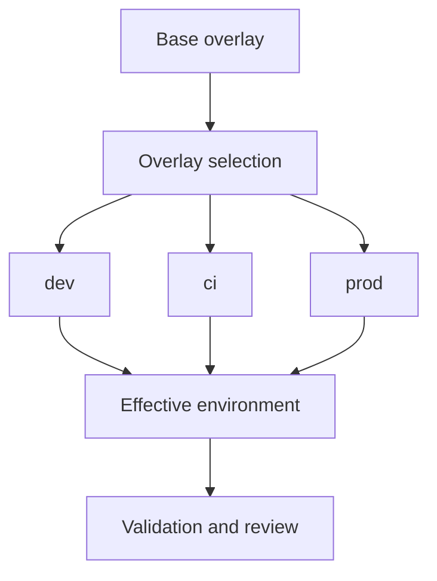

# Environment Overlays

Environment overlays live under `ops/env/` and describe how Atlas runtime
behavior changes across base, dev, CI, prod, and overlay layers.

The overlay model should answer one question quickly: which parts of runtime
behavior come from the base environment and which parts are allowed to diverge
per environment. Good overlay docs stop operators from creating silent
environment folklore around permissions, cluster profile, or network mode.

## Source of Truth

- `ops/env/base/`
- `ops/env/dev/`
- `ops/env/ci/`
- `ops/env/prod/`
- `ops/env/overlays/`

## Overlay Semantics

- `base` defines the shared defaults such as namespace, cluster profile, and
  restricted execution assumptions
- `dev` relaxes write and subprocess permissions for local work
- `ci` and `prod` preserve the more restricted execution model
- overlays should change only what the environment legitimately owns, not the
  underlying release or topology contract
