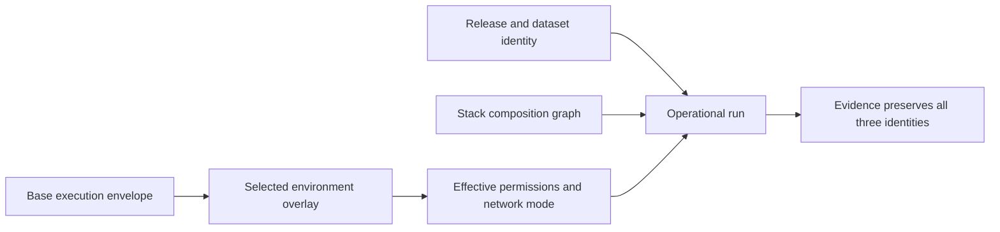

# Environment Overlays

Environment overlays control the execution envelope for Atlas operational
work. They define namespace, cluster profile, filesystem-write authority,
subprocess authority, and network mode. They do not select release bytes,
dataset identity, chart membership, or production topology.

## Declared Values

| Environment | Namespace | Cluster profile | Filesystem write | Subprocess | Network mode |
| --- | --- | --- | ---: | ---: | --- |
| `base` | `atlas-e2e` | `kind` | no | no | restricted |
| `ci` | `atlas-e2e` | `kind` | no | no | restricted |
| `prod` | `atlas-e2e` | `kind` | no | no | restricted |
| `dev` | `atlas-e2e` | `kind` | yes | yes | local |

The current `base`, `ci`, and `prod` overlays are equivalent. The `prod` name
therefore does not describe a production deployment; it describes a restricted
execution envelope using the same end-to-end namespace and Kind cluster
profile. Production readiness must come from Kubernetes profiles, security
contracts, immutable artifacts, and environment-specific evidence.

## Resolution Model

```mermaid
flowchart LR
    B["Base execution envelope"] --> O["Selected environment overlay"]
    O --> E["Effective permissions and network mode"]
    R["Release and dataset identity"] --> Run["Operational run"]
    G["Stack composition graph"] --> Run
    E --> Run
    Run --> P["Evidence preserves all three identities"]
```

An overlay may narrow or explicitly grant effects. It must not silently replace
the stack graph, values profile, or release manifest. Keep environment effect
selection separate from application configuration so a permissive developer
run cannot be mistaken for restricted evidence.

## Review Rules

- Treat `allow_write`, `allow_subprocess`, and `network_mode` changes as
  capability changes.
- Verify the namespace is safe for every permitted effect.
- Reject unknown keys and invalid inheritance through the overlay schema.
- Record the effective overlay, not only the requested environment name.
- Require separate evidence before calling any overlay production-safe.

If a command needs broader effects than the chosen overlay permits, change the
declared operating intent or stop the run. Do not bypass the envelope and retain
the original profile claim.
