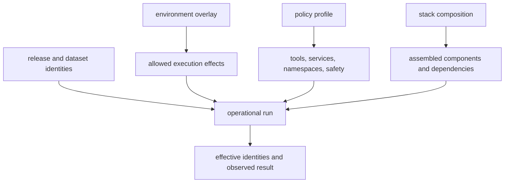

# Environment Overlays

Environment overlays describe which side effects an operational run may use.
They do not choose Atlas release bytes, chart resources, dataset identity, or a
production topology. The overlay name is therefore never sufficient evidence
of where or how a run executed.

## Current envelopes

| Overlay | Namespace | Cluster profile | Filesystem write | Subprocess | Network mode |
| --- | --- | --- | ---: | ---: | --- |
| `base` | `atlas-e2e` | `kind` | no | no | restricted |
| `ci` | `atlas-e2e` | `kind` | no | no | restricted |
| `prod` | `atlas-e2e` | `kind` | no | no | restricted |
| `dev` | `atlas-e2e` | `kind` | yes | yes | local |

`base`, `ci`, and `prod` currently resolve to identical values. In particular,
the `prod` overlay still selects the `atlas-e2e` namespace and Kind profile. It
is a restricted execution envelope, not a production deployment definition.
Do not cite its name as production evidence.

## Overlay, profile, and composition are different

```mermaid
flowchart TD
    Overlay["environment overlay"] --> Effects["allowed execution effects"]
    Profile["policy profile"] --> Intent["tools, services, namespaces, safety"]
    Composition["stack composition"] --> Graph["assembled components and dependencies"]
    Release["release and dataset identities"] --> Run["operational run"]
    Effects --> Run
    Intent --> Run
    Graph --> Run
    Run --> Evidence["effective identities and observed result"]
```

The overlay's `cluster_profile: kind` does not enumerate services. The profile
registry does that. The stack graph records what was assembled. Kubernetes
values and release manifests bind deployable state. Preserve each identity
instead of collapsing them into an environment label.

## Resolve effects before execution

An operation that writes evidence, invokes Helm, calls kubectl, creates a Kind
cluster, or reaches a network dependency needs the corresponding effects.
Select an envelope that authorizes the intended operation and still matches the
claim under review.

| Intended action | Required concern |
| --- | --- |
| inspect registries or build a plan | prefer a no-effect path |
| render files under `artifacts/` | filesystem-write authority |
| invoke Helm, Kind, kubectl, or a validator | subprocess authority |
| download, pull, or contact a service | network mode and destination policy |
| mutate a cluster | effects plus context, namespace, and explicit mutation guard |

A command-line effect flag does not rewrite the overlay. If the effective run
exceeds the selected envelope, the evidence must say so or the run must stop.

## Review changes as capability changes

Changes to `allow_write`, `allow_subprocess`, or `network_mode` expand or narrow
what automation may do. Review namespace and cluster-profile changes as target
changes. Validate overlays against `ops/schema/env/overlay.schema.json` and
reject unknown keys or ambiguous inheritance.

For every operational report, record the effective overlay values, selected
policy profile, stack composition, release identity, target context, and actual
effects. This makes a restricted dry run distinguishable from a live mutation
even when both were requested under the same environment name.
