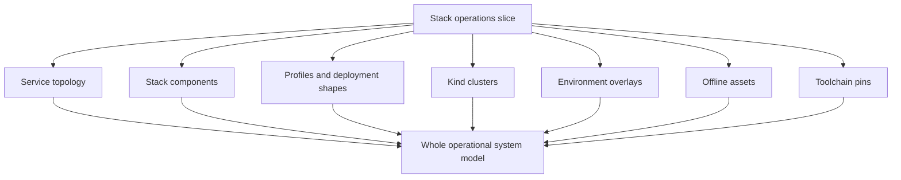

# Stack

`bijux-atlas-ops/stack` explains the operational environment in which
`bijux-atlas` runs, including the service itself, its supporting dependencies,
profile shapes, cluster substrates, overlays, and pinned toolchain inputs.

This section is the operator’s system map. It explains what runs alongside the
Atlas runtime, which profiles are supported, how different local or CI
environments are assembled, and which dependencies are required to make the
stack predictable and reviewable.

## Purpose

Use this section when you need to reason about the complete runtime system
rather than a single release, observability, or Kubernetes artifact.

## Source of Truth

- `ops/stack/*`
- `ops/env/*`
- `ops/docker/*`
- `ops/inventory/toolchain.json`

## Main Takeaway

The stack is not a backdrop. It is part of the contract. Operators need to know
which components are required, how profiles assemble them, how overlays and
clusters change the shape, and how that whole system is validated.

## Pages

- [Cache and Store Operations](cache-and-store-operations.md)
- [Dependency Graph](dependency-graph.md)
- [Deployment Models](deployment-models.md)
- [Environment Overlays](environment-overlays.md)
- [Kind Clusters](kind-clusters.md)
- [Local Stack Profiles](local-stack-profiles.md)
- [Offline Assets](offline-assets.md)
- [Service Topology](service-topology.md)
- [Stack Components](stack-components.md)
- [Toolchain Pins](toolchain-pins.md)
