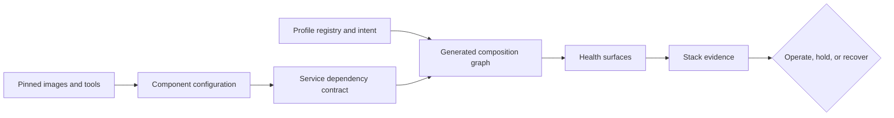

# Atlas Stack

The Atlas stack is the declared environment around the serving runtime: cluster
substrate, chart, object store, cache, observability services, profiles, and
pinned container inputs. Each layer has a different authority. Keeping those
authorities separate prevents a development convenience from becoming an
accidental production dependency.

## Stack Authority

```mermaid
flowchart LR
    I["Pinned images and tools"] --> C["Component configuration"]
    C --> D["Service dependency contract"]
    P["Profile registry and intent"] --> G["Generated composition graph"]
    D --> G
    G --> H["Health surfaces"]
    H --> E["Stack evidence"]
    E --> O{"Operate, hold, or recover"}
```

The profile registry declares seven operating intentions: `ci`, `dev`,
`developer`, `kind`, `minimal`, `perf`, and `small`. The generated composition
graph is narrower and currently covers `ci`, `kind`, and `local`. `local` is a
composition identity in `stack.toml`; it is not an entry in the seven-profile
policy registry.

## Supported Composition Graphs

| Composition | Cluster shape | Required components | Optional components included |
| --- | --- | --- | --- |
| `ci` | small Kind cluster | chart, observability namespace, MinIO, Redis | none |
| `local` | small Kind cluster | chart, observability namespace, MinIO, Redis | none |
| `kind` | normal Kind cluster | chart, observability namespace, MinIO, Redis | Prometheus, Grafana, OpenTelemetry collector |

The service dependency contract marks the chart, observability namespace,
MinIO, and Redis as critical for all three generated compositions. The
observability services are noncritical and required only by the `kind`
composition. Required here means required by the checked-in stack contract; it
does not imply that every external Atlas deployment must use the same backend.

## Route by Operating Question

| Question | Read |
| --- | --- |
| Which components are actually governed? | [Stack Components](stack-components.md) |
| What fails when a dependency is unavailable? | [Dependency Graph](dependency-graph.md) |
| How does a request cross runtime and dependencies? | [Service Topology](service-topology.md) |
| Which deployment shape fits the environment? | [Deployment Models](deployment-models.md) |
| What does each local profile permit and require? | [Local Stack Profiles](local-stack-profiles.md) |
| Which Kind substrate is selected? | [Kind Clusters](kind-clusters.md) |
| How do environment values alter the base? | [Environment Overlays](environment-overlays.md) |
| How are cache and store failures handled? | [Cache and Store Operations](cache-and-store-operations.md) |
| What is needed without network access? | [Offline Assets](offline-assets.md) |
| Which external bytes are pinned? | [Toolchain Pins](toolchain-pins.md) |

## Change Rule

A component, dependency edge, profile, or pin change is an operational contract
change. Update the owning input, regenerate stack inventories and the dependency
graph, review failure isolation and profile impact, then preserve the resulting
evidence. A successful pod start does not prove that the intended composition
was assembled.
