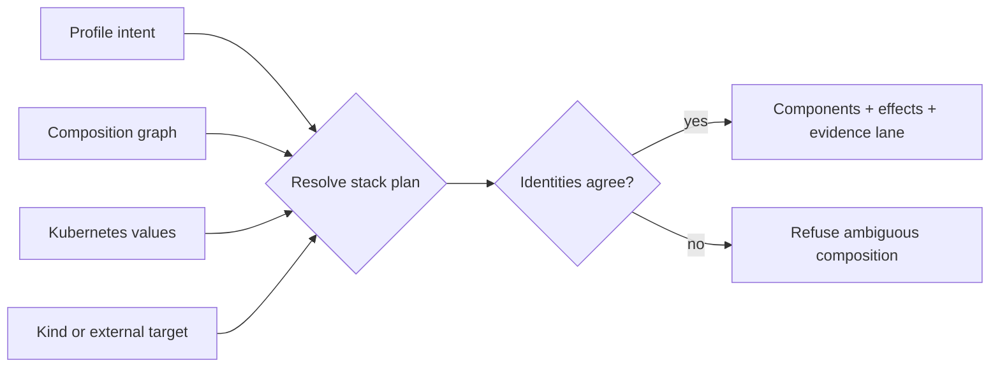
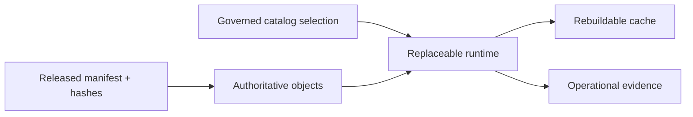

# Atlas stack

The Atlas stack is the environment around the serving runtime: cluster
substrate, Helm delivery, object storage, cache, telemetry services, profiles,
and pinned external inputs. These components do not share one source of truth.
The stack contract joins their authorities into an inspectable composition.

## Resolve intent into topology

Atlas uses profile names in several places. Equal spelling does not guarantee
equal meaning, and the current vocabularies deliberately differ.

| Authority | Selects | Current vocabulary |
| --- | --- | --- |
| profile registry | Intended use, safety level, allowed effects, and required dependencies | `ci`, `dev`, `developer`, `kind`, `minimal`, `perf`, `small` |
| composition graph | Concrete resources, Kind size, namespace, and critical services | `ci`, `kind`, `local` |
| Kubernetes values | Chart behavior and deployment posture | Entries governed by `ops/k8s/install-matrix.json` |
| Kind profile | Cluster substrate selected by a composition | `small` or `normal` in current compositions |

`local`, for example, is a composition identity but not a profile-registry
entry. It grants no effects by itself. Resolve policy, composition, values, and
target before execution instead of deriving permissions from a shared name.

```mermaid
flowchart LR
    Intent[Profile intent] --> Resolver{Resolve stack plan}
    Graph[Composition graph] --> Resolver
    Values[Kubernetes values] --> Resolver
    Target[Kind or external target] --> Resolver
    Resolver --> Guard{Identities agree?}
    Guard -->|yes| Plan[Components + effects + evidence lane]
    Guard -->|no| Refuse[Refuse ambiguous composition]
```

## Supported generated compositions

| Composition | Cluster shape | Critical components | Additional services |
| --- | --- | --- | --- |
| `ci` | small Kind cluster | chart, observability namespace, MinIO, Redis | none |
| `local` | small Kind cluster | chart, observability namespace, MinIO, Redis | none |
| `kind` | normal Kind cluster | chart, observability namespace, MinIO, Redis | Prometheus, Grafana, OpenTelemetry collector |

This is the checked-in composition contract, not a requirement that every
external Atlas deployment use these backends.

## Effective stack receipt

A profile name does not identify what actually ran. Preserve a receipt that
connects planned authority to admitted and observed state:

| Boundary | Minimum identity |
| --- | --- |
| intent | Policy profile, safety level, allowed effects, and registry hashes |
| composition | Graph profile, component set, dependency edges, and criticality |
| delivery | Chart, values chain, image digests, tools, and rendered-manifest digest |
| target | Cluster, namespace, Kubernetes version, storage, network, and workload identity |
| admission | Controller revision, live-object digest, mutation result, and non-secret config identities |
| observation | Release, dataset, catalog, dependency health, readiness, and telemetry-source identities |

When admitted state differs from the plan, classify the mutation or drift
through its owning authority. Do not silently promote live objects to source of
truth.

## State and replacement

```mermaid
flowchart LR
    Manifest[Released manifest + hashes] --> Store[Authoritative objects]
    Catalog[Governed catalog selection] --> Runtime[Replaceable runtime]
    Store --> Runtime
    Runtime --> Cache[Rebuildable cache]
    Runtime --> Signals[Operational evidence]
```

| Surface | Role | Requirement after replacement |
| --- | --- | --- |
| release artifacts | Immutable truth | Manifest and payload hashes still match |
| catalog | Selects admissible releases | Selected release and catalog generation are unambiguous |
| runtime | Executes the serving contract | Image, config, catalog, and dataset identities match |
| cache | Derived acceleration | Reused or rebuilt entries bind to verified store data |
| object-store service | Hosts authoritative bytes | Durability, integrity, and access are verified |
| telemetry pipeline | Transports evidence | Loss, delay, and recovery remain visible |

Dependency criticality and failure behavior are separate properties. Store
failure can remove serving eligibility. Cache failure may permit bounded
bypass while increasing latency and backend pressure. Telemetry failure can
leave traffic intact while making promotion unsafe.

## Route by operating question

| Question | Read |
| --- | --- |
| Which components are governed? | [Stack Components](stack-components.md) |
| What propagates when a dependency fails? | [Dependency Graph](dependency-graph.md) |
| How does a request cross the stack? | [Service Topology](service-topology.md) |
| Which deployment shape fits? | [Deployment Models](deployment-models.md) |
| What does each local profile mean? | [Local Stack Profiles](local-stack-profiles.md) |
| Which Kind substrate is selected? | [Kind Clusters](kind-clusters.md) |
| How do environment values alter the base? | [Environment Overlays](environment-overlays.md) |
| How are cache and store failures handled? | [Cache and Store Operations](cache-and-store-operations.md) |
| What is required without network access? | [Offline Assets](offline-assets.md) |
| Which external bytes are pinned? | [Toolchain Pins](toolchain-pins.md) |

A component, dependency edge, profile, or pin change changes the operational
contract. Update the owning input, regenerate its inventories, review failure
isolation, and retain the resulting evidence. A started pod does not prove that
the intended composition was assembled.
