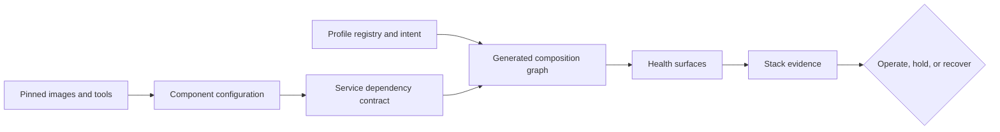
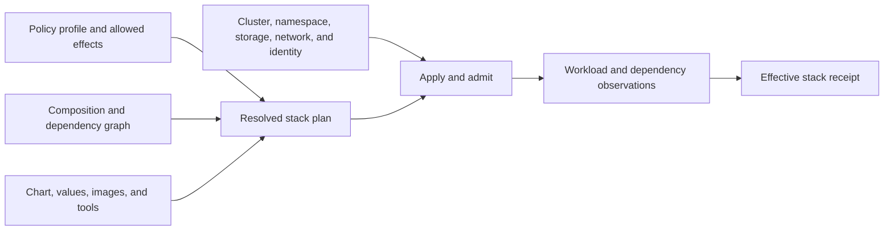
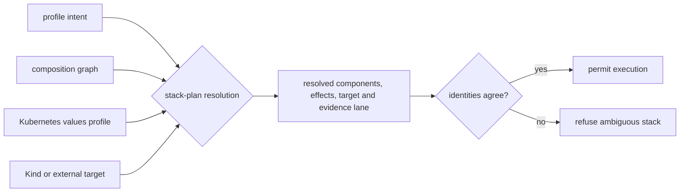
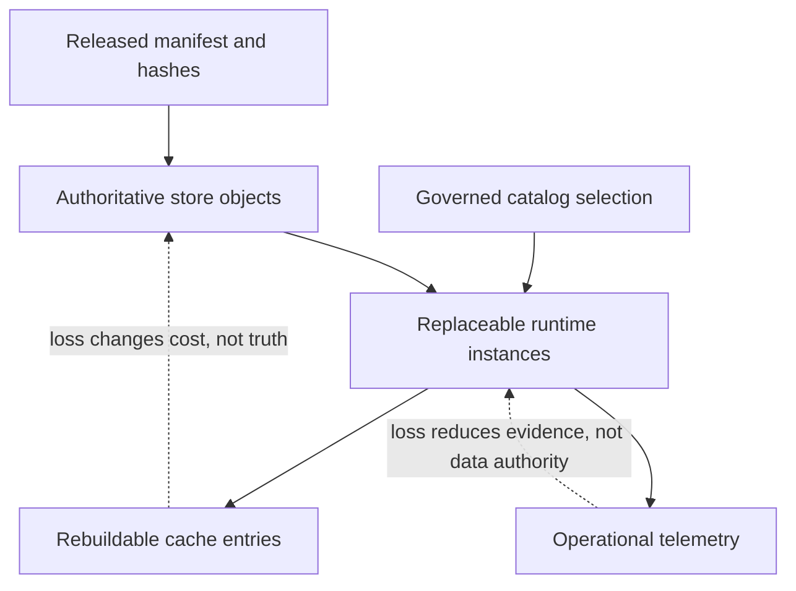
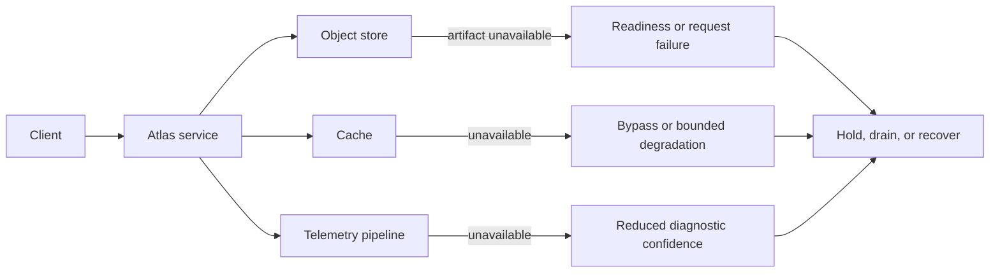

# Atlas Stack

The Atlas stack is the declared environment around the serving runtime: cluster
substrate, chart, object store, cache, observability services, profiles, and
pinned container inputs. Each layer has a different authority. Keeping those
authorities separate prevents a development convenience from becoming an
accidental production dependency.

## Stack Authority

```mermaid
flowchart LR
    I["Pinned images and tools"] --> C["Component configuration"]
    C --> D["Service dependency contract"]
    P["Profile registry and intent"] --> G["Generated composition graph"]
    D --> G
    G --> H["Health surfaces"]
    H --> E["Stack evidence"]
    E --> O{"Operate, hold, or recover"}
```

The profile registry declares seven operating intentions: `ci`, `dev`,
`developer`, `kind`, `minimal`, `perf`, and `small`. The generated composition
graph is narrower and currently covers `ci`, `kind`, and `local`. `local` is a
composition identity in `stack.toml`; it is not an entry in the seven-profile
policy registry.

## Effective Stack Receipt

A profile name does not identify a running stack. Before mutation, resolve the
authorities that select behavior; after mutation, record what the cluster
actually admitted and what the runtime consumed.

```mermaid
flowchart LR
    Intent[Policy profile and allowed effects] --> Plan[Resolved stack plan]
    Composition[Composition and dependency graph] --> Plan
    Delivery[Chart, values, images, and tools] --> Plan
    Target[Cluster, namespace, storage, network, and identity] --> Apply[Apply and admit]
    Plan --> Apply
    Apply --> Observe[Workload and dependency observations]
    Observe --> Receipt[Effective stack receipt]
```

| Receipt boundary | Minimum identity |
| --- | --- |
| intent | policy profile, safety level, allowed effects, and registry hashes |
| composition | `stack.toml` profile, generated dependency graph, component set, and criticality contract |
| delivery | chart package, values chain, image and platform digests, tool versions, and rendered-manifest digest |
| target | cluster and context UID, namespace, Kubernetes version, node classes, storage classes, network policy, and workload identity |
| admitted state | controller revision, live-object digest, defaulting and mutation result, and resolved secret or config identities without secret values |
| observed service | release, dataset, catalog, dependency health, readiness, and telemetry-source identities |

The receipt makes similarly named profiles distinguishable across machines and
clusters. It also exposes when the admitted state differs from the rendered
plan. Do not repair that disagreement by treating live objects as the new
source of truth; classify the mutation or drift through its owning authority.

## Supported Composition Graphs

| Composition | Cluster shape | Required components | Optional components included |
| --- | --- | --- | --- |
| `ci` | small Kind cluster | chart, observability namespace, MinIO, Redis | none |
| `local` | small Kind cluster | chart, observability namespace, MinIO, Redis | none |
| `kind` | normal Kind cluster | chart, observability namespace, MinIO, Redis | Prometheus, Grafana, OpenTelemetry collector |

The service dependency contract marks the chart, observability namespace,
MinIO, and Redis as critical for all three generated compositions. The
observability services are noncritical and required only by the `kind`
composition. Required here means required by the checked-in stack contract; it
does not imply that every external Atlas deployment must use the same backend.

## Resolve Profile Vocabulary Before Execution

Atlas uses profile names in several authorities. Equal spelling is not enough
to prove equal meaning, and some authorities intentionally expose different
sets. Resolve them into one stack plan before a command receives effects.

| Authority | Selection controls | Current vocabulary |
| --- | --- | --- |
| profile intent registry | intended use, safety level, allowed effects and required dependencies | `ci`, `dev`, `developer`, `kind`, `minimal`, `perf`, `small` |
| composition graph | concrete resource list, Kind size, namespace and critical services | `ci`, `kind`, `local` |
| Kubernetes values | chart behavior and deployment posture | governed by `ops/k8s/install-matrix.json` |
| Kind profile | cluster substrate selected by a composition | `small` or `normal` for current compositions |

```mermaid
flowchart LR
    Intent[profile intent] --> Resolver{stack-plan resolution}
    Composition[composition graph] --> Resolver
    Values[Kubernetes values profile] --> Resolver
    Target[Kind or external target] --> Resolver
    Resolver --> Plan[resolved components, effects, target and evidence lane]
    Plan --> Guard{identities agree?}
    Guard -->|yes| Execute[permit execution]
    Guard -->|no| Refuse[refuse ambiguous stack]
```

`local` demonstrates the boundary: it is a valid composition identity but not
an entry in the profile-intent registry. A caller must not infer permissions
from that name. The resolved plan must carry the policy identity that grants
the requested effects, the composition identity that selects resources, and
the values identity that controls the chart.

## Plane Ownership

| Plane | Components | Authority |
| --- | --- | --- |
| substrate | Kind or external cluster, namespaces, storage classes, network | supplies execution and isolation primitives |
| delivery | Helm chart, profiles, image pins, and generated composition | declares what should run |
| serving | Atlas runtime, catalog, immutable store, and cache | resolves and serves dataset state |
| observation | Prometheus, Grafana, collector, probes, and diagnostics | measures behavior and preserves investigation context |
| recovery | retained artifacts, configuration, backups, rollback targets | restores a previously verified operating identity |

The stack contract names a composition; it does not transfer authority between
planes. Prometheus cannot establish dataset integrity. Redis cannot become a
catalog. A Helm release record cannot prove the runtime answered correctly.
Keep these boundaries visible. Diagnose one plane at a time. Then test the
cross-plane effect before restoring traffic or promotion authority.

## Durable State and Replaceable Services

The stack is recoverable only when operators can replace execution components
without inventing or losing dataset authority. Persisted does not necessarily
mean authoritative, and replaceable does not mean operationally free.

| Surface | State role | Replacement expectation | Authority required after replacement |
| --- | --- | --- | --- |
| release artifacts and manifests | immutable released truth | restored or replicated without changing content identity | artifact hashes and manifest binding match the released set |
| catalog | selects admissible dataset releases | restored from a governed recovery point or reconciled explicitly | selected release and catalog generation are unambiguous |
| Atlas runtime | executes the serving contract | pods and processes may be recreated | image, config, catalog, and dataset identities match the deployment |
| cache | derived acceleration state | entries may be evicted and rebuilt | every reused or rebuilt entry binds to verified store data |
| object-store service | hosts authoritative artifact bytes | service instances may change; governed objects may not change silently | durability, integrity, consistency, and access behavior are verified |
| telemetry pipeline | transports operating evidence | collectors may restart without rewriting observed history | gaps, delay, and recovery are visible in the evidence record |

```mermaid
flowchart TD
    M["Released manifest and hashes"] --> S["Authoritative store objects"]
    C["Governed catalog selection"] --> R["Replaceable runtime instances"]
    S --> R
    R --> K["Rebuildable cache entries"]
    R --> T["Operational telemetry"]
    K -. loss changes cost, not truth .-> S
    T -. loss reduces evidence, not data authority .-> R
```

Before replacing a component, identify whether the action changes bytes,
selection, execution, acceleration, or evidence. Restore normal traffic only
after the authority on both sides of that boundary agrees.

## Failure Propagation

```mermaid
flowchart LR
    Client[Client] --> Service[Atlas service]
    Service --> Store[Object store]
    Service --> Cache[Cache]
    Service --> Telemetry[Telemetry pipeline]
    Store -->|artifact unavailable| NotReady[Readiness or request failure]
    Cache -->|unavailable| Degraded[Bypass or bounded degradation]
    Telemetry -->|unavailable| Blind[Reduced diagnostic confidence]
    NotReady --> Decision[Hold, drain, or recover]
    Degraded --> Decision
    Blind --> Decision
```

Dependency criticality and failure behavior are separate properties. A
critical store failure can remove serving eligibility. Cache failure may be
recoverable within explicit latency and load budgets. Telemetry failure may
leave user traffic intact while making promotion unsafe because required
signals cannot be observed.

## Dependency Failure Budget

Before accepting a dependency, define its availability role and bounded
degradation:

| Property | Operator decision |
| --- | --- |
| startup requirement | may a new instance become ready without it? |
| steady-state requirement | may existing traffic continue, and for how long? |
| correctness impact | can failure change dataset or response meaning? |
| capacity impact | what backend pressure, queueing, or latency follows? |
| evidence impact | which required signals or audit records disappear? |
| recovery path | retry, bypass, cached-only mode, fail closed, or restore |

Exercise the selected degradation under load. A fallback that works for one
request may collapse under concurrency or hide stale state during an outage.

| Dependency condition | Runtime concern | Operator concern |
| --- | --- | --- |
| store unavailable or inconsistent | artifact resolution and query correctness | stop promotion; verify readiness, manifest identity, and recovery |
| cache unavailable or saturated | latency, backend pressure, and overload | confirm bypass behavior and capacity before continuing |
| telemetry pipeline unavailable | loss or delay of required signals | preserve local diagnostics and treat evidence gaps explicitly |
| version or pin drift | unreviewed bytes in the composition | reconcile declared and observed identity before release use |

## Route by Operating Question

| Question | Read |
| --- | --- |
| Which components are actually governed? | [Stack Components](stack-components.md) |
| What fails when a dependency is unavailable? | [Dependency Graph](dependency-graph.md) |
| How does a request cross runtime and dependencies? | [Service Topology](service-topology.md) |
| Which deployment shape fits the environment? | [Deployment Models](deployment-models.md) |
| What does each local profile permit and require? | [Local Stack Profiles](local-stack-profiles.md) |
| Which Kind substrate is selected? | [Kind Clusters](kind-clusters.md) |
| How do environment values alter the base? | [Environment Overlays](environment-overlays.md) |
| How are cache and store failures handled? | [Cache and Store Operations](cache-and-store-operations.md) |
| What is needed without network access? | [Offline Assets](offline-assets.md) |
| Which external bytes are pinned? | [Toolchain Pins](toolchain-pins.md) |

## Change Rule

A component, dependency edge, profile, or pin change is an operational contract
change. Update the owning input, regenerate stack inventories and the dependency
graph, review failure isolation and profile impact, then preserve the resulting
evidence. A successful pod start does not prove that the intended composition
was assembled.
