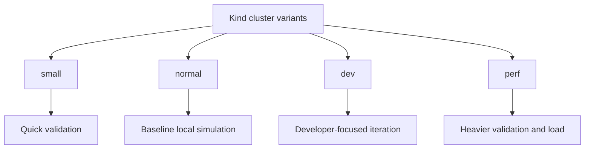

# Kind Clusters

Atlas keeps Kind cluster definitions under `ops/stack/kind/` so local and CI
cluster shape stays declared and reviewable.

These variants exist because Atlas does not pretend one cluster shape can serve
every validation goal honestly. The Kind definitions let operators choose a
cluster capacity and port shape that matches the profile and the suites they
intend to run.

## Cluster Variants

- `cluster.yaml`
- `cluster-dev.yaml`
- `cluster-small.yaml`
- `cluster-perf.yaml`

## How They Differ

- `cluster-small.yaml` reduces `max-pods` to `60` and is the right fit for
  smaller local or CI profiles
- `cluster.yaml` and `cluster-dev.yaml` use `max-pods: 110` for baseline and
  developer-oriented cluster simulation
- `cluster-perf.yaml` raises `max-pods` to `220` for heavier profile pressure
- `ops/k8s/kind/cluster.yaml` is the simulation-focused Kubernetes cluster
  definition and should be read alongside, not instead of, the stack variants
