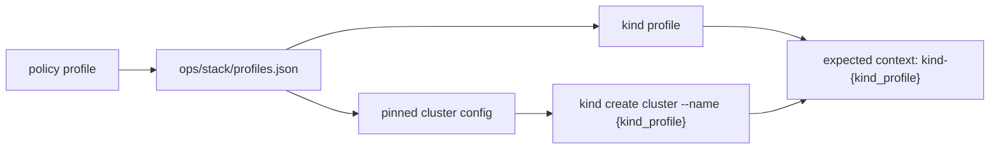
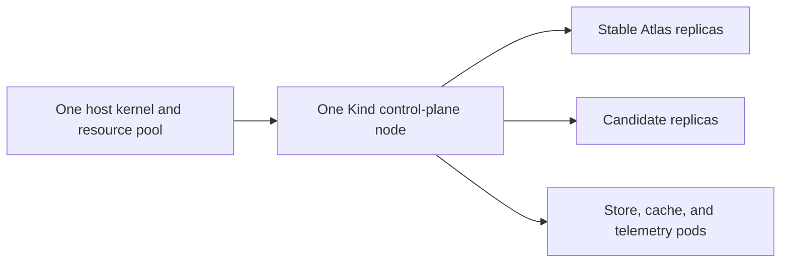

# Kind Clusters

Atlas uses pinned, single-node Kind clusters for local installation,
conformance, and load evidence. A profile selects a cluster capacity class and
configuration file; the control plane then creates the cluster under the
profile's `kind_profile` name.

## Declared cluster shapes

| Capacity class | Config | Selected by | Pod ceiling |
| --- | --- | --- | ---: |
| `small` | `cluster-small.yaml` | `minimal`, `small`, `ci` | 60 |
| `normal` | `cluster.yaml` | `kind`, `developer` | 110 |
| `normal` | `cluster-dev.yaml` | `dev` | 110 |
| `perf` | `cluster-perf.yaml` | `perf` | 220 |

All four files pin the same Kind node image, bind the API server to localhost,
and expose the same host ports: `18080` for HTTP, `18443` for HTTPS, and `19090`
for the metrics mapping. They also use the same eviction floor. Today their
material capacity difference is `max-pods`; `cluster-dev.yaml` does not add a
different node topology.


```mermaid
flowchart LR
    Profile["policy profile"] --> Map["ops/stack/profiles.json"]
    Map --> Class["kind profile"]
    Map --> Config["pinned cluster config"]
    Class --> Context["expected context: kind-{kind_profile}"]
    Config --> Create["kind create cluster --name {kind_profile}"]
    Create --> Context
```

## Create and identify the cluster

Inspect the selected profile before mutation:

```bash
cargo run -p bijux-atlas-dev -- ops profile explain perf --format json
```

Create its Kind cluster with explicit effects:

```bash
cargo run -p bijux-atlas-dev -- ops kind up \
  --profile perf \
  --allow-subprocess \
  --allow-write \
  --allow-network \
  --format json
```

The expected kubectl context is derived from the capacity class, not the
policy profile. For example, `perf` expects `kind-perf`; `kind` and `developer`
both expect `kind-normal`. Record the policy profile, capacity class, config
digest, and resulting context together.

Before apply, status, logs, ports, or conformance commands, the operations layer
checks the active context. A mismatch fails unless `--force` is supplied.
`--force` is a safety override, not evidence that the target was correct. Keep
it out of normal automation and record its use when emergency procedure
requires it.

## Capacity claims

A larger pod ceiling does not prove that the workstation has enough CPU,
memory, storage, or file descriptors. It also does not install the metrics
server, Atlas chart, Redis, or observability services. Those belong to the
selected profile and stack composition.

Use `small` for contract and constrained-environment checks, `normal` for local
service behavior, and `perf` only with a declared load scenario and resource
inventory. A successful Kind creation proves the cluster exists. It does not
prove that Atlas is installed, ready, conformant, or within capacity budgets.

## Bound Claims to the Single-Node Topology

All four stack cluster configurations contain one control-plane node and no
worker nodes. Increasing `max-pods` changes a kubelet ceiling; it does not add
failure domains, independent schedulers, network paths, or physical capacity.


```mermaid
flowchart LR
    Host[One host kernel and resource pool] --> Node[One Kind control-plane node]
    Node --> Stable[Stable Atlas replicas]
    Node --> Candidate[Candidate replicas]
    Node --> Dependencies[Store, cache, and telemetry pods]
```

| Behavior | Kind can exercise | Production claim still missing |
| --- | --- | --- |
| scheduling | requests, limits, selectors, and one-node placement | cross-node and cross-zone placement, anti-affinity, and topology spread |
| disruption | pod deletion and process restart | node loss, zone loss, control-plane loss, and simultaneous infrastructure repair |
| networking | ClusterIP, NodePort mapping, DNS, and NetworkPolicy behavior in the selected CNI | external load balancer, ingress implementation, cloud firewall, and multi-node data path |
| storage | declared PVC and ephemeral-volume behavior with installed local providers | production storage class, attachment, replication, expansion, snapshots, and zone recovery |
| capacity | bounded contention on the recorded host | independently provisioned node capacity and autoscaler response |

For load evidence, record host CPU, memory, storage, container runtime, and
background contention alongside the cluster config. Results from the `perf`
shape are local-system measurements, not a production capacity envelope. For
resilience evidence, state explicitly which failure domains the single node
cannot represent.

## Port and ownership safety

The declared API and service ports are fixed. Two cluster variants cannot bind
them concurrently without host-port conflicts. Before creating a cluster:

- confirm the expected ports are free;
- inspect existing Kind clusters and kubectl context;
- avoid deleting a cluster by display name alone;
- preserve the creation output and selected config digest with run evidence.

Deletion is destructive to cluster-local state. Export required debug bundles
and conformance reports before `ops kind down` or a stack reset.

The separate `ops/k8s/kind/cluster.yaml` belongs to system simulation and uses
its own cluster identity. Do not substitute it for a stack profile config or
merge evidence from the two cluster authorities.
