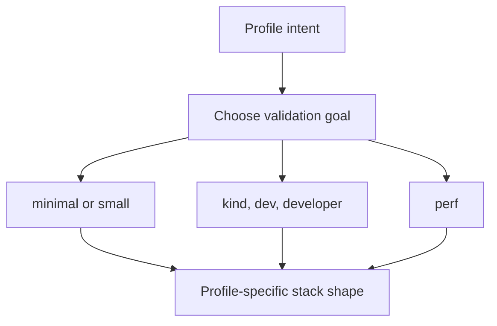

# Local Stack Profiles

Local and CI stack behavior is shaped by declared profiles rather than ad hoc
compose commands.

Profiles are the operator-friendly way to select a whole stack shape without
guessing which cluster config, tools, namespaces, or services belong together.
The right question is not “which profile sounds nice,” but “which validation
goal am I trying to prove?”

## Source of Truth

- `ops/stack/profile-intent.json`
- `ops/stack/profiles.json`
- `ops/stack/kind/`

## Profile System

The declared profile set currently includes:

- `minimal` and `small` for restricted local validation
- `ci` for deterministic CI validation
- `kind`, `dev`, and `developer` for fuller local cluster work
- `perf` for performance and autoscaling-oriented validation

Each profile connects intent, allowed effects, required dependencies, cluster
config, required tools, allowed namespaces, and required services.
