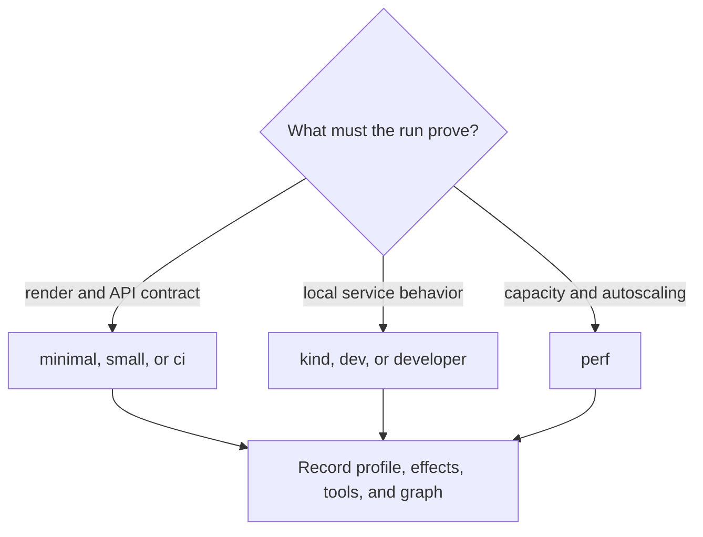

# Local Stack Profiles

Profiles name an operating intention. Each binds permitted effects, tools,
dependencies, cluster shape, namespace scope, and service expectations. The
names are not interchangeable labels for the same installation.

## Policy Profiles

| Profile | Intended use | Safety | Required runtime services | Notable prerequisite |
| --- | --- | --- | --- | --- |
| `minimal` | Smallest contract-coverage footprint | restricted | API | Small Kind cluster and rendered manifests |
| `small` | Reduced local validation | restricted | API and query | Small Kind cluster and rendered manifests |
| `ci` | Deterministic validation | restricted | API and query | Helm, Kubeconform, and no network effect |
| `kind` | Baseline local cluster and smoke checks | standard | API, query, Redis | Health endpoint |
| `dev` | Iterative local development | standard | API, query, Redis | Network, filesystem write, and subprocess effects |
| `developer` | Workstation cluster defaults | standard | API, query, Redis | Same effect class as `dev` |
| `perf` | Load and autoscaling evidence | strict | API, query, Redis, metrics | Metrics server and health endpoint |

The policy registry also limits namespaces and lists optional components. The
performance profile is the only stage-class entry; the remaining profiles are
development-class and must not be promoted into production by name alone.

## Profile Selection

```mermaid
flowchart TD
    Claim{"What must the run prove?"}
    Claim -->|render and API contract| Restricted["minimal, small, or ci"]
    Claim -->|local service behavior| Local["kind, dev, or developer"]
    Claim -->|capacity and autoscaling| Perf["perf"]
    Restricted --> Evidence["Record profile, effects, tools, and graph"]
    Local --> Evidence
    Perf --> Evidence
```

Choose the narrowest profile that can prove the intended claim. Do not use
`perf` to compensate for an undefined workload, or `dev` to claim restricted
execution. A profile result is invalid when the run exceeds its registered
effects, namespaces, tools, or services. Any exception must be declared.

## Composition Boundary

`ops/stack/profiles.json` maps seven names to Kind cluster configurations. The
generated dependency graph and `stack.toml` cover only `ci`, `kind`, and
`local`. Here, `local` is a generated stack composition that uses the small
cluster; it is not one of the policy-registry profiles.

Record both identities when they differ. The policy profile explains allowed
behavior. The composition graph explains which services were assembled. Do not
infer full component membership from a cluster configuration alone.

## Evidence Record

Preserve the profile ID, composition ID, cluster configuration digest, allowed
effects, namespaces, tool versions, component graph, rendered values, health
results, and any exception. This makes local, CI, and performance results
comparable without pretending they exercised identical environments.
