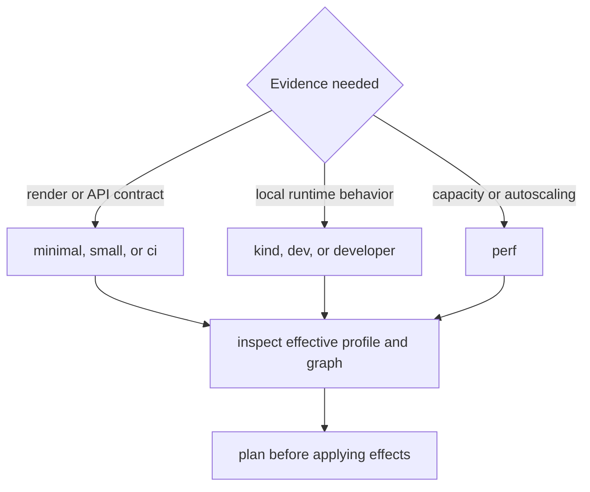
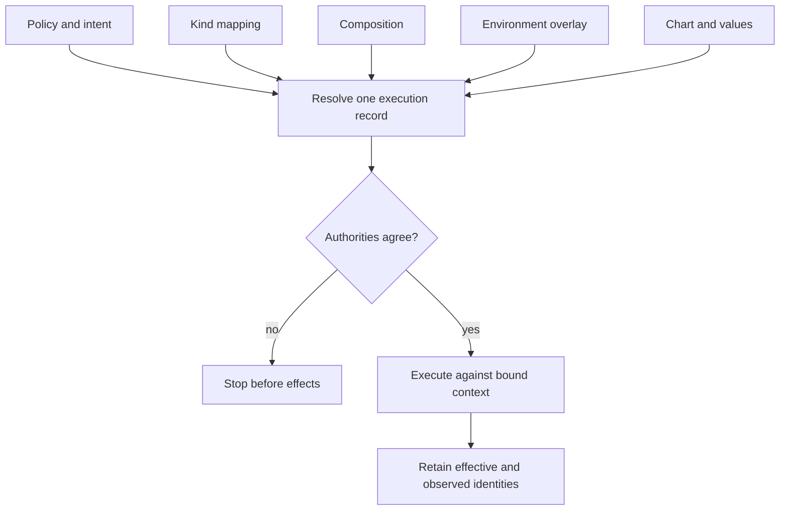

# Local Stack Profiles

A stack profile binds an operating intent to tools, permitted effects,
namespaces, services, and a Kind cluster shape. Select a profile by the claim
the run must support, then retain the resolved profile with the evidence.

## Profile Contract

| Profile | Safety | Required services | Kind class | Intended claim |
| --- | --- | --- | --- | --- |
| `minimal` | restricted | API | small | smallest installation contract |
| `small` | restricted | API, query | small | constrained local behavior |
| `ci` | restricted | API, query | small | deterministic validation |
| `kind` | standard | API, query, Redis | normal | baseline cluster and smoke behavior |
| `dev` | standard | API, query, Redis | normal | iterative local development |
| `developer` | standard | API, query, Redis | normal | workstation cluster defaults |
| `perf` | strict | API, query, Redis, metrics | perf | capacity, load, and autoscaling evidence |

The intent registry allows subprocess and filesystem effects for every profile.
Network is additionally allowed for `kind`, `dev`, `developer`, and `perf`.
The profile registry further constrains required tools, allowed namespaces, and
optional components. Both registries matter; neither replaces the other.

## Select and Inspect

List and explain profiles before running a stack mutation:

```bash
cargo run -p bijux-atlas-dev -- ops profile list --format json
cargo run -p bijux-atlas-dev -- ops profile explain kind --format json
```


```mermaid
flowchart TD
    Need{"Evidence needed"}
    Need -->|render or API contract| Restricted["minimal, small, or ci"]
    Need -->|local runtime behavior| Standard["kind, dev, or developer"]
    Need -->|capacity or autoscaling| Performance["perf"]
    Restricted --> Inspect["inspect effective profile and graph"]
    Standard --> Inspect
    Performance --> Inspect
    Inspect --> Plan["plan before applying effects"]
```

Use the narrowest profile that contains the required services and effects. The
`perf` profile does not make an undefined workload valid. The `dev` profile
does not make a permissive run suitable for restricted evidence.

## Keep the Registries Distinct

Atlas currently has several related profile authorities:

- `ops/stack/profiles.json` maps seven policy names to Kind classes and files;
- `ops/stack/profile-intent.json` declares intended use, effects, and required
  dependencies;
- `ops/stack/profile-registry.json` declares safety, tools, namespaces, and
  required or optional services;
- `stack.toml` and the generated dependency graph describe stack composition;
- Kubernetes values define the rendered application configuration.

The generated stack graph covers `ci`, `kind`, and `local`. `local` is a
composition identifier that uses the small cluster; it is not one of the seven
policy profiles. Record both identifiers when a run combines them.

## Resolve the Effective Profile

The current registries do not form one implicit inheritance chain. In
particular, environment overlays select `atlas-e2e`, policy profiles allow
`atlas-dev` and related namespaces, and the stack compositions declare
`bijux-atlas`. Resolve these differences before any cluster mutation.

| Resolution input | Record in the plan |
| --- | --- |
| policy profile | safety level, required tools and services, allowed namespaces, optional components |
| profile intent | intended use, allowed effects, and required dependencies |
| Kind mapping | cluster class and exact cluster-configuration digest |
| stack composition | component paths, namespace, and generated dependency-graph digest |
| environment overlay | requested effects, network mode, namespace, and cluster profile |
| Kubernetes delivery | values chain, image digests, chart identity, and install-matrix scenario |

Fail before mutation when the target namespace is outside the selected
profile, the cluster configuration differs from the resolved mapping, a
required service has no component or external owner, or the effect envelope
cannot authorize the intended operation. A successful render cannot reconcile
those authority conflicts.


```mermaid
flowchart TD
    Policy[Policy and intent] --> Resolve[Resolve one execution record]
    Kind[Kind mapping] --> Resolve
    Stack[Composition] --> Resolve
    Overlay[Environment overlay] --> Resolve
    Delivery[Chart and values] --> Resolve
    Resolve --> Validate{Authorities agree?}
    Validate -->|no| Stop[Stop before effects]
    Validate -->|yes| Execute[Execute against bound context]
    Execute --> Receipt[Retain effective and observed identities]
```

## Plan, Execute, and Accept

Start with a plan so missing components and effect requirements are visible.
Execution commands require explicit effect flags and enforce the expected Kind
context before cluster mutation.

A profile run is acceptable only when:

- its effective effects stayed within profile intent;
- its tools and namespaces match the registry;
- its cluster config and rendered values are identified by digest;
- required services reached their defined readiness conditions;
- optional components are reported as present or absent;
- the observed result supports the stated claim.

Profile validation proves registry and configuration coherence. It does not
prove a live cluster, application readiness, load capacity, or production
suitability. Carry those observations as separate evidence.
