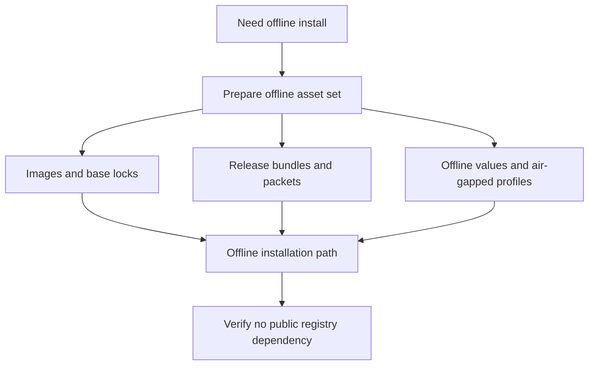

# Offline Assets

Offline install and validation paths need declared assets and explicit
distribution inputs, not implicit access to public registries.

Offline claims are easy to fake in prose and hard to prove in practice. This
page exists to make the artifact set explicit: if the required images, packet,
bundle metadata, and offline profile values are not present, the install is not
honestly offline.

## Source of Truth

- `ops/e2e/scenarios/ops-distribution/offline-install-from-bundle.json`
- `ops/docker/`
- `ops/release/packet/`
- `ops/docker/airgap-policy.json`
- `ops/docker/bases.lock`
- `ops/release/ops-release-bundle-manifest.json`
- `ops/k8s/values/offline.yaml`
- `ops/k8s/values/prod-airgap.yaml`

## Exact Offline Asset Set

An honest offline install path should include:

- digest-pinned base image information from `ops/docker/bases.lock`
- the air-gap policy that forbids uncontrolled network fetch behavior
- the release packet and release bundle manifest
- the offline or air-gapped Kubernetes values files that define runtime intent

## Main Takeaway

Offline readiness is an artifact claim, not a deployment mood. If the asset set
cannot be assembled and verified without public network assumptions, the path is
not ready to be called offline.
