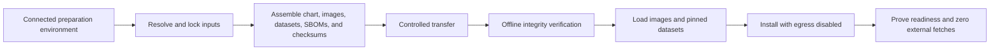

# Offline Assets

An offline Atlas installation is a closed artifact set plus evidence that the
installation made no undeclared network request. Cached-only runtime values are
necessary, but they do not prove that images, charts, datasets, schemas, and
tools were transported or verified.

## Offline Trust Boundary

```mermaid
flowchart LR
    Online["Connected preparation environment"] --> Lock["Resolve and lock inputs"]
    Lock --> Bundle["Assemble chart, images, datasets, SBOMs, and checksums"]
    Bundle --> Transfer["Controlled transfer"]
    Transfer --> Verify["Offline integrity verification"]
    Verify --> Prewarm["Load images and pinned datasets"]
    Prewarm --> Install["Install with egress disabled"]
    Install --> Probe["Prove readiness and zero external fetches"]
```

## Required Asset Classes

- the chart package and exact values profile;
- the Atlas image and every init, sidecar, and dependency image by digest;
- pinned dataset artifacts, catalog metadata, and their checksums;
- SBOMs, provenance, checksum ledger, and evidence policy;
- Kubernetes schemas and the tools needed for local rendering and validation;
- base-image locks and build inputs when building inside the boundary; and
- rollback artifacts for the previous supported release.

`offline.yaml` and `prod-airgap.yaml` select cached-only service behavior. They
disable catalog readiness, external store endpoints, DNS egress, and declared
Redis, MinIO, catalog, and telemetry dependencies. Both prewarm dataset
`110/homo_sapiens/GRCh38` before serving.

## Current Repository Evidence

The checked-in offline distribution record is a simulation, not an executed
air-gapped installation. It references a `v0.1.0` bundle while the current
operations release manifest declares workspace and chart version `0.2.0`. Its
chart and image digests are repeated-digit fixtures. The offline and production
air-gap values also use repeated-digit image digests.

The Docker air-gap policy requires digest-pinned bases and locked or vendored
inputs. It forbids `curl`, `wget`, and `git` in the build path, but still permits
specific `apt-get` and locked Cargo build tokens. That policy describes an
air-gap-capable build contract; it is not proof that a particular build used no
network.

The production air-gap values enable network policy and disable egress, while
also carrying a governed exception that permits the disabled policy mode until
2027-03-03. Verify the rendered policy rather than inferring isolation from the
profile name.

## Acceptance

Accept an offline claim only when one coherent release version is present,
every image and dataset resolves locally by immutable digest, the release
packet verifies inside the disconnected boundary, installation and rollback
complete without registry or catalog access, and network observation records
no undeclared egress.

Preserve the transported inventory, digests, transfer record, verification
result, loaded-image inventory, rendered manifests, network-policy result,
readiness evidence, and rollback outcome. Until those conditions pass with
non-fixture identities, describe the checked-in path as simulated coverage.

See [Release Evidence](../release/release-evidence.md) for current packet
limitations and [Security Operations](../kubernetes/security-operations.md) for
rendered network-policy review.
