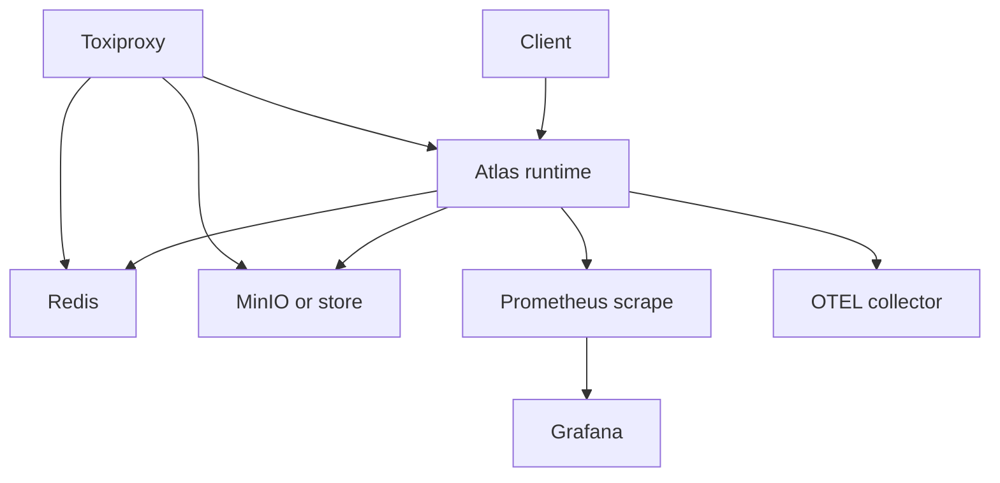

# Service Topology

Atlas operations span the runtime service plus supporting dependencies such as
Redis, MinIO, Prometheus, Grafana, OpenTelemetry, and Toxiproxy.

Topology matters because operators do not troubleshoot components one by one in
real incidents. They troubleshoot paths. This page should make it obvious which
links are required, which ones are optional or observability-related, and where
failure isolation can or cannot exist.

## Source of Truth

- `ops/stack/`
- `ops/observe/`
- `ops/k8s/`

## Topology Rules

- the runtime-to-store path is part of the durable serving path
- the runtime-to-Redis path is performance-oriented, not the authoritative data
  path
- Prometheus, Grafana, and OTEL enrich visibility but should not be mistaken
  for serving dependencies
- Toxiproxy is a fault-injection surface and changes topology assumptions only
  during rehearsal or test scenarios
