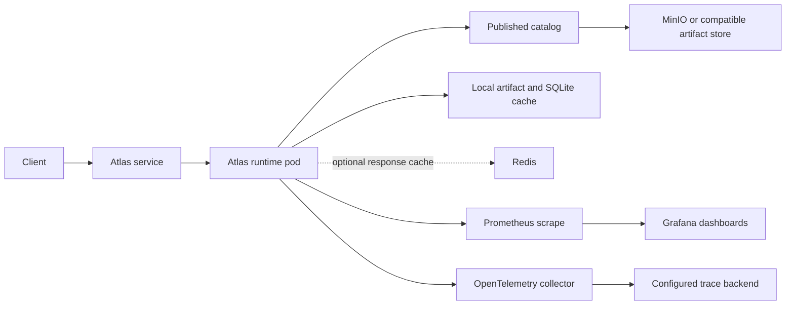
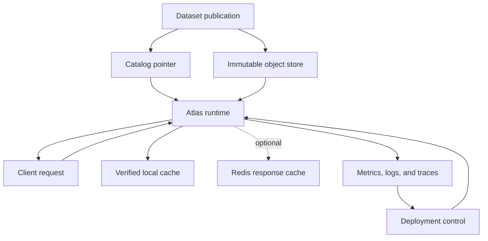
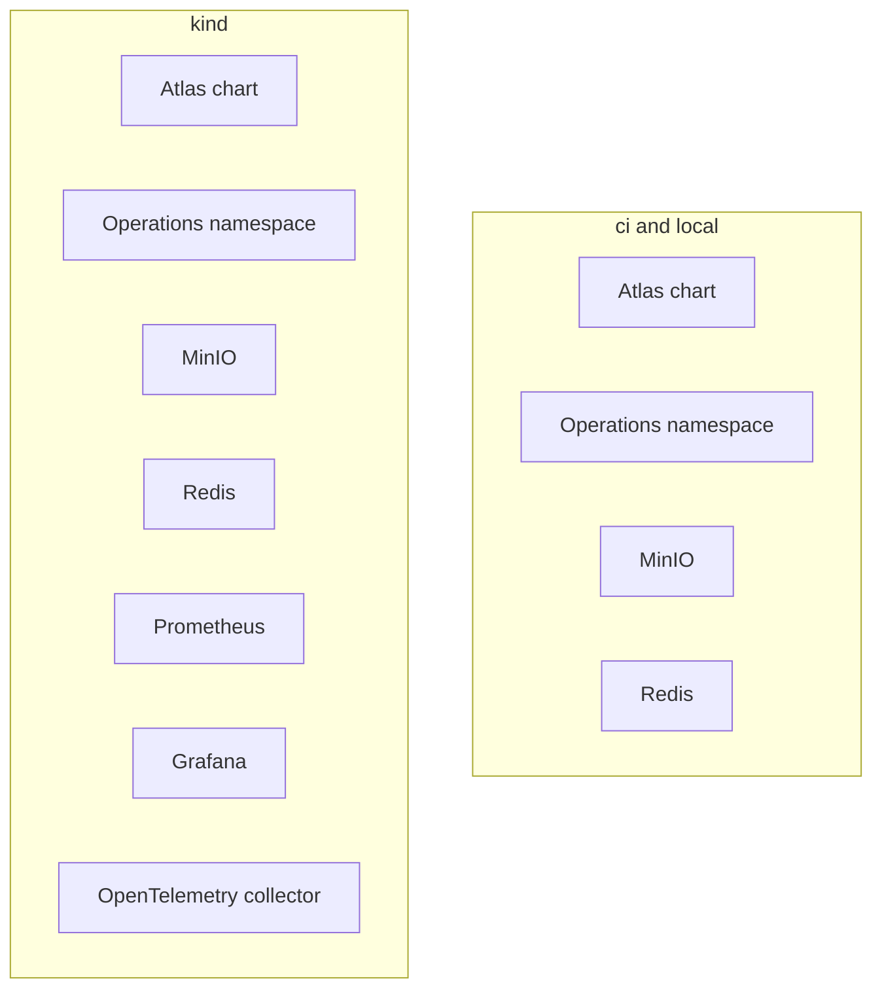
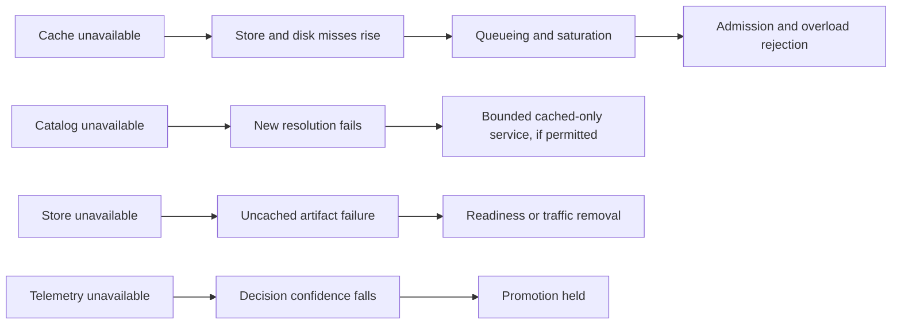

# Service Topology

Atlas serves immutable dataset releases through an HTTP runtime backed by
published object state and local serving caches. Redis can accelerate selected
responses. Prometheus, Grafana, and OpenTelemetry provide visibility. Fault
injection components belong to governed test environments, not the production
serving path.

## Runtime and Evidence Paths

```mermaid
flowchart LR
    Client[Client] --> Service[Atlas service]
    Service --> Pod[Atlas runtime pod]
    Pod --> Catalog[Published catalog]
    Catalog --> Objects[MinIO or compatible artifact store]
    Pod --> Disk[Local artifact and SQLite cache]
    Pod -. optional response cache .-> Redis[Redis]
    Pod --> Metrics[Prometheus scrape]
    Pod --> Traces[OpenTelemetry collector]
    Metrics --> Grafana[Grafana dashboards]
    Traces --> TraceBackend[Configured trace backend]
```

Solid arrows are serving or evidence paths. The Redis path is optional and
non-authoritative. Prometheus, Grafana, and the collector do not determine
dataset truth, but losing them reduces the evidence available for promotion and
incident decisions.

## Request, Data, and Control Flows

```mermaid
flowchart TB
    Publisher[Dataset publication] --> Objects[Immutable object store]
    Publisher --> Catalog[Catalog pointer]
    Operator[Deployment control] --> Runtime[Atlas runtime]
    Catalog --> Runtime
    Objects --> Runtime
    Client[Client request] --> Runtime
    Runtime --> Local[Verified local cache]
    Runtime -. optional .-> Redis[Redis response cache]
    Runtime --> Client
    Runtime --> Evidence[Metrics, logs, and traces]
    Evidence --> Operator
```

Publication mutates durable data and discovery state. Deployment control
mutates runtime and configuration. Client requests consume the selected state;
they do not publish it. Telemetry reports what happened but does not authorize
a catalog or deployment change. Keeping these flows separate makes rollback
scope explicit.

## Trust Boundaries

| Boundary | Required identity | Verification before use |
| --- | --- | --- |
| client to runtime | route, principal class when enabled, request ID, and dataset selector | authentication, authorization, input, cost, and response limits |
| runtime to catalog | environment, catalog epoch or freshness, and dataset tuple | admissible selection and readiness policy |
| runtime to object store | manifest, object key, artifact hash, and schema version | integrity and compatibility before serving |
| runtime to cache | release, query, contract, and policy identity | entry binding before reuse |
| runtime to telemetry | release, profile, route class, request/trace correlation | schema, cardinality, redaction, export, and retention contracts |

Network reachability alone proves none of these bindings. Credentials should
grant the narrowest operation needed at each boundary; serving runtimes do not
need publication authority merely because both use the same store.

## Dependency Classes

| Component | Role | Authority | Failure consequence |
| --- | --- | --- | --- |
| Atlas chart and runtime | query, metadata, health, and telemetry surface | runtime behavior for the selected release | service unavailable or degraded |
| catalog | discoverable dataset identities and artifact references | publication authority | new resolution can fail; cached-only behavior depends on configuration |
| MinIO or compatible store | published manifests and immutable artifacts | durable release bytes | uncached artifacts and refreshes fail |
| local cache | opened SQLite, sequence, index, and manifest material | acceleration derived from the store | misses require refetch; disk limits can shed work |
| Redis | optional exact-gene response cache | no release authority | falls back to normal query execution when policy permits |
| Prometheus | metric collection and rule evaluation | operational evidence | alert and capacity visibility degrades |
| Grafana | operator visualization | no independent authority | investigation loses canonical views |
| OpenTelemetry collector | trace export pipeline | operational evidence | distributed request linkage degrades |
| Toxiproxy | controlled dependency failure injection | test-only scenario control | deliberately changes latency or availability during rehearsal |

## Profile Topologies

The committed stack manifest materializes three dependency shapes:

```mermaid
flowchart TB
    subgraph Small[ci and local]
        SmallChart[Atlas chart]
        SmallNamespace[Operations namespace]
        SmallStore[MinIO]
        SmallRedis[Redis]
    end
    subgraph Full[kind]
        FullChart[Atlas chart]
        FullNamespace[Operations namespace]
        FullStore[MinIO]
        FullRedis[Redis]
        FullProm[Prometheus]
        FullGrafana[Grafana]
        FullOtel[OpenTelemetry collector]
    end
```

`ops/stack/service-dependency-contract.json` marks the chart, operations
namespace, MinIO, and Redis components as critical for these committed stack
profiles. The observability components are non-critical dependencies in the
service contract, but they are required to claim full operational evidence for
the `kind` profile.

## Failure Amplification Paths

```mermaid
flowchart LR
    CacheLoss[Cache unavailable] --> Misses[Store and disk misses rise]
    Misses --> Saturation[Queueing and saturation]
    Saturation --> Rejection[Admission and overload rejection]
    CatalogLoss[Catalog unavailable] --> RefreshFail[New resolution fails]
    RefreshFail --> CachedOnly[Bounded cached-only service, if permitted]
    StoreLoss[Store unavailable] --> ArtifactMiss[Uncached artifact failure]
    ArtifactMiss --> NotReady[Readiness or traffic removal]
    TelemetryLoss[Telemetry unavailable] --> Blind[Decision confidence falls]
    Blind --> Hold[Promotion held]
```

A dependency can fail without corrupting release truth and still create a
second-order outage. Cache loss shifts demand to authoritative storage. Catalog
loss blocks new discovery even when retained artifacts remain valid. Telemetry
loss can leave requests successful while removing the evidence required to
promote or safely tune capacity.

Contain the first changed boundary before increasing retries or replicas.
Unbounded retries can multiply store pressure; scaling a blind workload can
multiply bad requests; clearing every cache can turn a localized stale entry
into a fleet-wide cold start.

## Failure Isolation

- A Redis outage is not a store outage. Response-cache failures should fall
  back without changing dataset identity.
- A catalog outage is not artifact corruption. Already cached data may remain
  usable under cached-only policy, while ordinary readiness can require a live
  catalog.
- A telemetry outage is not proof of healthy serving. It reduces confidence and
  can block promotion even if query traffic still succeeds.
- A local disk-cache failure can exhaust or evict derived state without
  changing the immutable source artifact.
- Fault injection must be bounded by a named scenario and removed after the
  evidence run.

## Topology Invariants

- Dataset truth remains in immutable published artifacts and their governed
  catalog identity, never in Redis, dashboards, or a local cache alone.
- A runtime release change does not silently change the selected dataset.
- A dataset promotion does not silently authorize a runtime or policy change.
- Loss of an evidence component is visible as reduced decision confidence,
  even when serving remains available.
- Recovery names the boundary restored and validates downstream consumers
  before traffic or promotion resumes.

Continue with [Cache and Store Operations](cache-and-store-operations.md),
[Dependency Graph](dependency-graph.md), and
[Observability](../observability/index.md).
