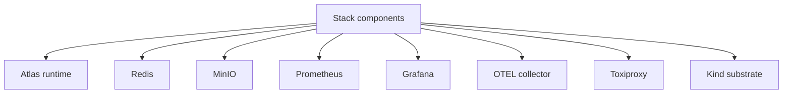

# Stack Components

The core stack components are declared under `ops/stack/` and exercised through
`make stack-up`, `make stack-down`, and related control-plane commands.

The component catalog exists so operators can answer the same set of questions
for every part of the stack: what it does, whether it is required, where it is
declared, how it is checked, and what breaks if it fails. Without that, a stack
page becomes a name list instead of a working system reference.

## Main Components

- runtime service
- Redis
- MinIO
- Prometheus
- Grafana
- OpenTelemetry collector
- Toxiproxy

## Responsibility Blocks

- runtime service: required, serves the Atlas API and query path, validated via
  stack, Kubernetes, load, and observability surfaces
- Redis: critical cache component for declared profiles, configured in
  `ops/stack/redis/redis.yaml`, health surface `stack.redis-ready`
- MinIO: critical durable object-store component, configured in
  `ops/stack/minio/minio.yaml`, health surface `stack.minio-ready`
- Prometheus: optional observability component for richer profiles, configured
  in `ops/stack/prometheus/prometheus.yaml`
- Grafana: optional visualization component, configured in
  `ops/stack/grafana/grafana.yaml`
- OTEL collector: optional tracing and telemetry intake component, configured in
  `ops/stack/otel/otel-collector.yaml`
- Toxiproxy: optional failure-rehearsal component, configured in
  `ops/stack/toxiproxy/toxiproxy.yaml`
