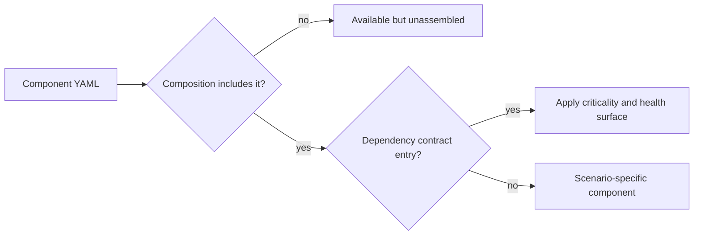

# Stack Components

Atlas stack components fall into three categories: serving dependencies,
observability dependencies, and test-only fault infrastructure. The category
determines whether absence blocks stack admission and what evidence must be
preserved.

## Component Catalog

| Component | Role | Contract status | Health authority |
| --- | --- | --- | --- |
| Atlas Helm chart | Renders and deploys the runtime service | Critical in `ci`, `kind`, and `local` | Kubernetes install matrix |
| Observability namespace | Owns monitoring resources and isolation | Critical in `ci`, `kind`, and `local` | `observe.namespace-ready` |
| MinIO | Object-store dependency for governed stack compositions | Critical in `ci`, `kind`, and `local` | `stack.minio-ready` |
| Redis | Cache dependency for governed stack compositions | Critical in `ci`, `kind`, and `local` | `stack.redis-ready` |
| Prometheus | Metric collection and rule evaluation | Noncritical, included by `kind` | `observe.prometheus-ready` |
| Grafana | Operator visualization | Noncritical, included by `kind` | `observe.grafana-ready` |
| OpenTelemetry collector | Trace and telemetry intake | Noncritical, included by `kind` | `observe.otel-ready` |
| Toxiproxy | Controlled dependency-failure injection | Not in the stack dependency contract | Scenario-specific evidence |

The Kind node image is a substrate pin rather than a service node. Kubernetes
resource templates are owned by the chart, while MinIO, Redis, Prometheus,
Grafana, OpenTelemetry, and Toxiproxy configuration live under their respective
`ops/stack/` directories.

## Configuration Is Not Membership

The presence of a YAML file does not place a component in a profile. Membership
comes from `ops/stack/stack.toml` and the generated dependency graph.
Criticality and health surfaces come from
`ops/stack/service-dependency-contract.json`. Image identity comes from the
generated version manifest sourced from the central pin inventory.

```mermaid
flowchart LR
    Y["Component YAML"] --> A{"Composition includes it?"}
    A -->|no| U["Available but unassembled"]
    A -->|yes| C{"Dependency contract entry?"}
    C -->|yes| H["Apply criticality and health surface"]
    C -->|no| S["Scenario-specific component"]
```

## Component Acceptance

For every assembled component, retain its immutable image reference,
configuration digest, profile membership, namespace, health result, and
relevant credentials or network-policy identity. For a noncritical component,
also state which operational claims become unavailable when it fails.

Do not replace a failing dependency with a mock and retain the same evidence
claim. A mock, local filesystem, external Redis, or different object-store
backend defines a different composition and must be identified as such.

See [Dependency Graph](dependency-graph.md) for failure boundaries and
[Toolchain Pins](toolchain-pins.md) for immutable external identities.
