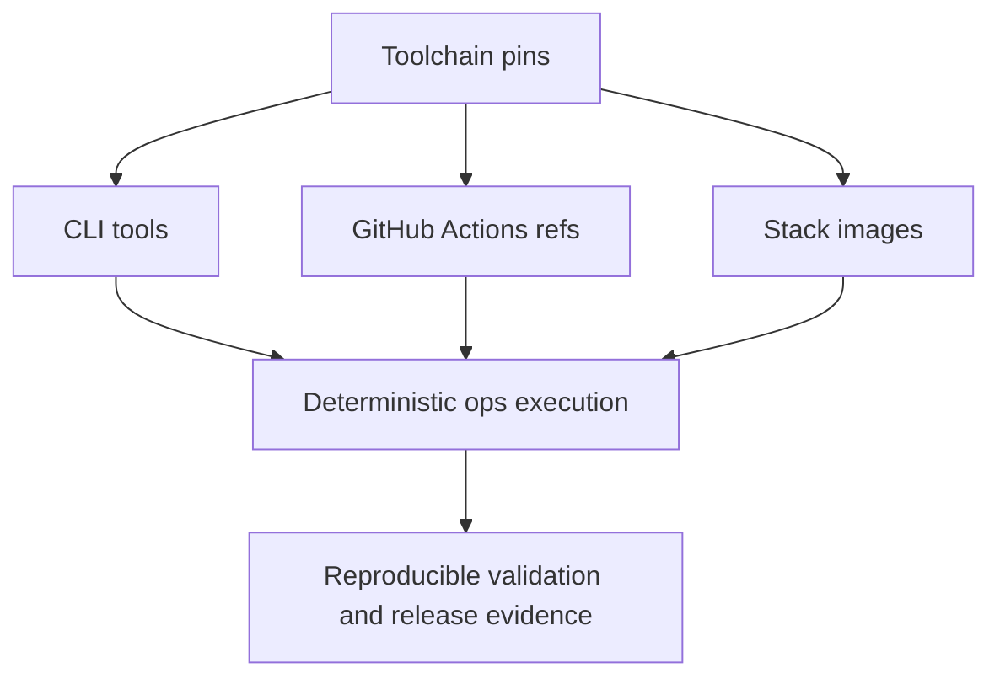

# Toolchain Pins

Operational reproducibility depends on declared tool pins for Helm,
Kubeconform, and related surfaces.

Pinning matters because operators do not just need successful runs. They need
explainable runs. Toolchain pins make it possible to say which Helm, Kind,
kubectl, kubeconform, image digests, and workflow actions were expected when the
evidence was produced.

## Source of Truth

- `ops/policy/effect-tool-version-policy.json`
- `ops/inventory/toolchain.json`
- `ops/schema/meta/pins.schema.json`

## Pinning Policy

- required CLI tools are declared in `ops/inventory/toolchain.json`
- GitHub Actions refs and SHAs are pinned in the same inventory
- stack image versions and digests are pinned alongside the tool inventory
- drift in these pins should be reviewed as a reproducibility risk, not only as
  a convenience update

## Evidence of Actual Use

Pinning is only meaningful when release, stack, or validation evidence can be
traced back to the declared toolchain inventory and version manifests.
