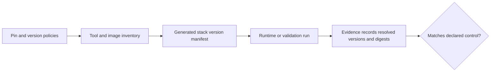

# Toolchain and External Input Pins

Atlas governs external inputs at different strengths. Container images and
GitHub Actions have immutable identities. Local operational tools are discovered
and version-checked, but most are not locked to an exact patch release by the
current contracts.

## Pin Strength

| Surface | Current control | Guarantee |
| --- | --- | --- |
| Stack images | Repository, tag, and SHA-256 digest | Immutable image identity when the digest is used at execution time |
| Docker bases | Named builder and runtime image digests | Immutable base input for governed builds |
| GitHub Actions | Human-readable ref plus commit SHA | Workflow action bytes are commit-bound |
| Docker, Syft, Trivy, Helm, Kubeconform, Kind | Allowed major-version policy | Compatibility range, not exact reproducibility |
| Curl, Helm, Kind, kubectl | Required executable plus parsed version | Presence and reportability, not an exact version lock |
| K6 and Kubeconform | Optional executable plus parsed version | Evidence can record use, but absence is permitted by this inventory |

## Resolution Chain

```mermaid
flowchart LR
    P["Pin and version policies"] --> I["Tool and image inventory"]
    I --> M["Generated stack version manifest"]
    M --> R["Runtime or validation run"]
    R --> E["Evidence records resolved versions and digests"]
    E --> D{"Matches declared control?"}
```

The generated stack manifest currently pins the Kind node, MinIO server and
client, Prometheus, OpenTelemetry collector, Redis, and Toxiproxy images. The
stack evolution policy requires pin freeze, version-manifest consistency, and
dependency-graph consistency.

## Reproducibility Rule

A declared pin is useful only when the run proves that it consumed that pin.
Record tool version output, action SHA, image digest observed by the runtime,
generated manifest identity, and source pin inventory. A tag-only component
manifest does not become immutable merely because a digest exists elsewhere.

Do not call a major-version allowance an exact pin. Results produced by Helm
3.14 and Helm 3.16 may both satisfy an `allowed_major: 3` policy while differing
in rendering behavior. When byte-for-byte or semantic reproducibility matters,
the release evidence must bind the exact tool versions used.

## Change Review

For an image or action update, inspect upstream provenance and behavior, change
the authoritative inventory, regenerate dependent manifests, and review the
resulting composition. For a tool compatibility change, review every command
whose output or validation semantics can differ. Preserve old and new versions
with the evidence so drift can be attributed rather than guessed.

See [Reproducibility](../release/reproducibility.md) for repeat-build claims and
[Stack Components](stack-components.md) for where pinned images enter a
composition.
