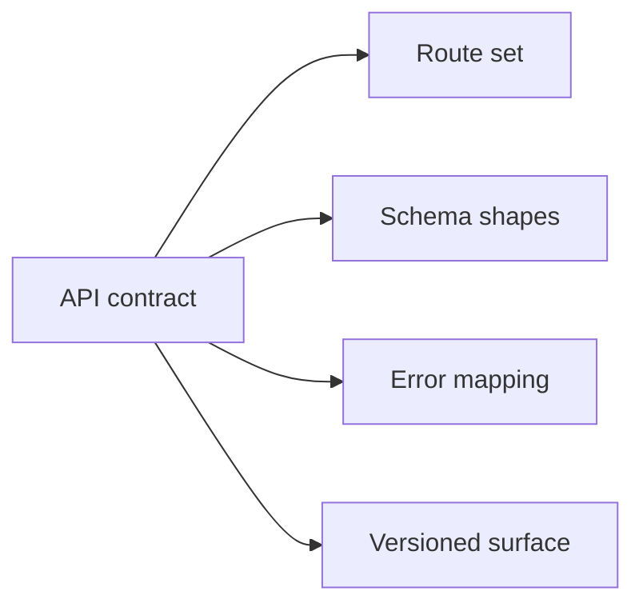
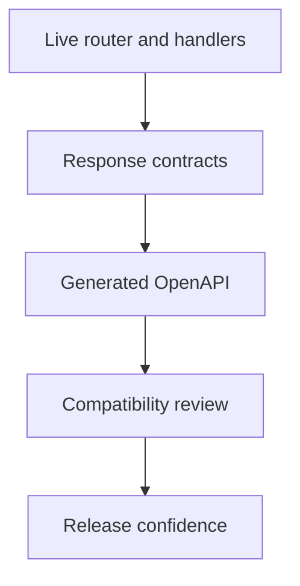

# API Compatibility

API compatibility defines what HTTP clients can reasonably rely on across Atlas changes.

## Compatibility Scope

This compatibility-scope diagram names the parts of the HTTP surface Atlas expects clients to rely
on intentionally. It is the contract boundary for API evolution decisions.

## Compatibility Model

This model makes the authority chain clearer. Compatibility review should start
from the live router and response contracts, then verify that the generated
OpenAPI still matches the promised public surface.

## Main Promise Areas

- route availability and naming
- structured response shape
- documented error code behavior
- OpenAPI representation of the stable surface

## Compatibility Authority Chain

- live route ownership is declared in [`src/adapters/inbound/http/router.rs`](/Users/bijan/bijux/bijux-atlas/crates/bijux-atlas/src/adapters/inbound/http/router.rs:1)
- handler behavior lives under [`src/adapters/inbound/http/`](/Users/bijan/bijux/bijux-atlas/crates/bijux-atlas/src/adapters/inbound/http)
- response and error-shape promises live in [`response_contract.rs`](/Users/bijan/bijux/bijux-atlas/crates/bijux-atlas/src/adapters/inbound/http/response_contract.rs:1) and [`src/contracts/errors/`](/Users/bijan/bijux/bijux-atlas/crates/bijux-atlas/src/contracts/errors)
- generated public API contract lives in [`configs/generated/openapi/v1/openapi.json`](/Users/bijan/bijux/bijux-atlas/configs/generated/openapi/v1/openapi.json:1)

## Change Classification

- additive: new documented route, field, or optional capability that preserves existing client behavior
- conditionally breaking: tightened validation, changed defaults, or behavior changes that keep shape but can still disrupt clients
- breaking: removed or renamed stable route, removed required field, incompatible response change, or altered documented error contract

## Non-Promise Areas

- undocumented debug routes
- incidental implementation details behind handlers
- internal runtime composition details that do not alter the public HTTP contract

## Purpose

This page defines the Atlas contract expectations for api compatibility. Use it when you need the explicit compatibility promise rather than a workflow narrative.

## Stability

This page is part of the checked-in contract surface. Changes here should stay aligned with tests, generated artifacts, and release evidence.

## Main Takeaway

API compatibility in Atlas is the combined promise of route identity, response
shape, documented errors, and generated OpenAPI. If one of those moves, the
compatibility story has changed whether or not the handler code still compiles.
