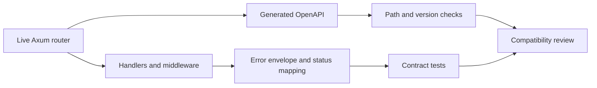

# API Compatibility

Atlas HTTP compatibility combines the live router, handler semantics, error
mapping, generated OpenAPI, and explicit endpoint lifecycle policy. No single
generated file proves all five agree.

```mermaid
flowchart LR
    Router[Live Axum router] --> Behavior[Handlers and middleware]
    Behavior --> Errors[Error envelope and status mapping]
    Router --> OpenAPI[Generated OpenAPI]
    OpenAPI --> Diff[Path and version checks]
    Errors --> Tests[Contract tests]
    Diff --> Review[Compatibility review]
    Tests --> Review
```

## Authority Chain

| Concern | Executable or declared authority |
| --- | --- |
| routes enabled by the server | `crates/bijux-atlas-server/src/adapters/inbound/http/router.rs` |
| request behavior and middleware | `crates/bijux-atlas-server/src/adapters/inbound/http/` |
| error body and HTTP status mapping | `response_contract.rs`, `bijux-atlas-api`, and the runtime error contracts |
| generated client description | `configs/generated/openapi/v1/openapi.json` |
| endpoint lifecycle intent | `ops/api/surface-registry.json` and OpenAPI version tracking |
| comparison baseline | `ops/api/goldens/openapi-v1.snapshot.json` |

The router conditionally adds `/debug/*` and `/v1/_debug/echo` routes when
admin endpoints are enabled. Those routes are operationally sensitive and do
not become stable public API merely because they exist in the router.

## Client Promise

For a stable endpoint, compatibility review covers:

- HTTP method and route identity;
- required query, path, header, and body inputs;
- response status, media type, and required fields;
- error code, error envelope, status mapping, and retry semantics;
- pagination, cursor, ordering, and limit behavior;
- authentication, authorization, and policy rejection behavior;
- representation in the generated OpenAPI contract.

Adding an optional field or endpoint is usually additive. Tightening
validation, reducing limits, changing defaults, or altering ordering can be
disruptive even when the schema remains valid. Removing or renaming a stable
route or required field is breaking unless a versioned replacement and
consumer transition are provided.

## Automation Coverage and Limits

`bijux-atlas-dev api diff` compares only the set of OpenAPI path keys. It does
not compare methods, parameters, schemas, responses, or error behavior. It
reports `status: changed` for added or removed paths but currently exits with
status code zero.

`bijux-atlas-dev api verify` checks that `info.version` matches the tracked
active version. It records the validation contract and writes path coverage,
but it does not execute every rule embedded in that contract. Its compatibility
report likewise establishes version equality, not semantic client
compatibility.

`bijux-atlas-dev api contract` generates indexes, templates, registry
snapshots, and example request/response records. The response examples assign a
generic `200` and `application/json` shape from OpenAPI operations; they are not
captured live-server responses.

Treat these outputs as focused evidence. Full compatibility requires router,
handler, error, schema, and behavior tests appropriate to the changed surface.

## Classify an API Change

| Proposed change | Default classification | Required review |
| --- | --- | --- |
| add an optional response field | additive, subject to tolerant-reader expectations | generated OpenAPI, serialization, and representative client behavior |
| add a new route | additive only when route policy, auth, limits, and errors are explicit | router/OpenAPI agreement and surface-registry ownership |
| tighten a limit or validation rule | potentially breaking | affected clients, structured errors, migration path, and rollout policy |
| change ordering, cursor meaning, or defaults | breaking for consumers that observe result sequence | query contract, pagination tests, and client migration |
| add or expose an administrative route | operational security change, not ordinary API growth | explicit enablement, authentication, authorization, audit, and exception review |
| remove or rename a stable `/v1` element | breaking | versioned replacement, overlap window, and consumer transition evidence |

Compatibility is assessed across the request, behavior, response, and
operational exposure together. A schema-only diff cannot classify changes to
defaults, authorization, ordering, rate limits, or error semantics.

## Change Review Boundary

Stable `/v1` routes and their documented contracts require compatibility
review. Health, readiness, metrics, and admin surfaces follow their operational
contracts. Undocumented implementation details remain internal only while
clients cannot observe them. Record the old and new observable behavior, the
authority for each, the consumers examined, and the focused evidence used to
support the classification.
