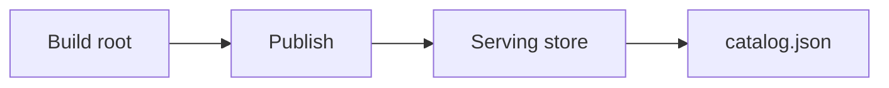
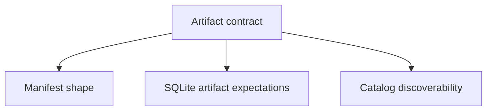

# Artifact and Store Contracts

Artifact and store contracts define how durable dataset state is shaped and
what the runtime expects to discover.

## Contracted Storage Shape

This storage-shape diagram names the durable handoff Atlas wants to protect:
build state becomes published store state, and the catalog is part of that
discoverable serving shape.

## Contract Focus

This focus diagram makes the artifact contract concrete. It is not only “some
files on disk”; it is manifest shape, SQLite artifact expectations, and
catalog discoverability together.

## Main Promise

Atlas should make the durable serving shape explicit enough that publication, serving, backup, and recovery can all reason about the same artifact model.

## Reading Rule

Use this page when the question is not whether artifacts exist, but whether the
published store shape is strong enough for serving, backup, and recovery.
