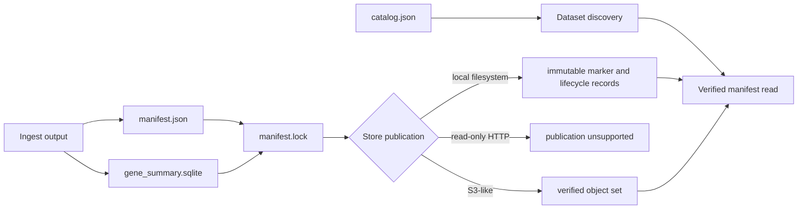
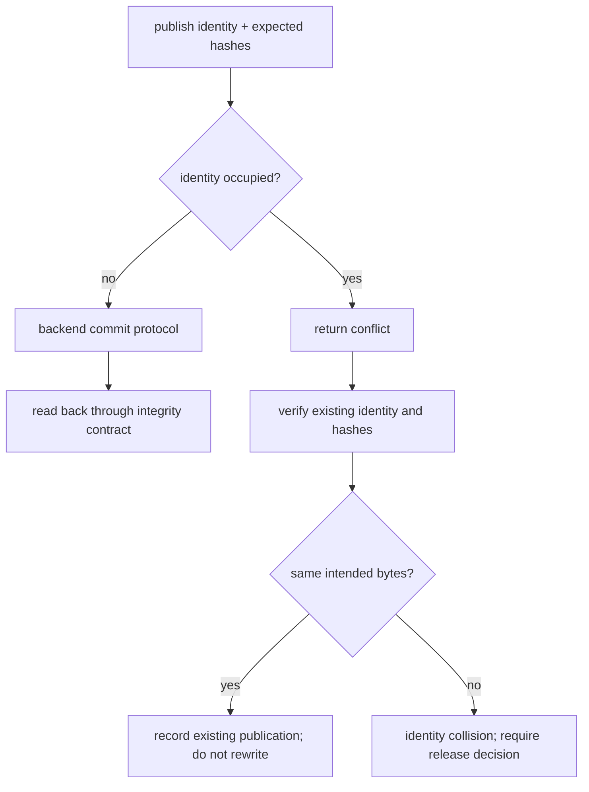

# Artifact and Store Contracts

Atlas addresses a dataset by identity and serves it through a
manifest-and-SQLite integrity pair. Publication evidence is backend-specific:
the local filesystem backend adds an immutable marker and lifecycle records,
whereas the S3-like backend publishes the pair and lock without those local
lifecycle files. Integrity, discoverability, and publication state are related
contracts, but they are not interchangeable.

```mermaid
flowchart LR
    Ingest[Ingest output] --> Manifest[manifest.json]
    Ingest --> SQLite[gene_summary.sqlite]
    Manifest --> Lock[manifest.lock]
    SQLite --> Lock
    Lock --> Publish{Store publication}
    Publish -->|local filesystem| Marker[immutable marker and lifecycle records]
    Publish -->|S3-like| Objects[verified object set]
    Publish -->|read-only HTTP| Unsupported[publication unsupported]
    Catalog[catalog.json] --> Discover[Dataset discovery]
    Discover --> Read[Verified manifest read]
    Marker --> Read
    Objects --> Read
```

## Dataset Layout

Each dataset uses the canonical `release/species/assembly` prefix. The store
contract recognizes:

| Path | Scope | Responsibility |
| --- | --- | --- |
| `<dataset>/manifest.json` | all backends | versioned dataset identity, input and artifact hashes, statistics, provenance references, scientific metadata, and schema identities |
| `<dataset>/gene_summary.sqlite` | all backends | queryable serving payload |
| `<dataset>/manifest.lock` | all backends | SHA-256 values for the exact manifest and SQLite bytes |
| `<dataset>/immutable.release.json` | local filesystem | publication marker binding dataset and expected checksums |
| `<dataset>/lifecycle.state.json` | local filesystem | current lifecycle state |
| `<dataset>/lifecycle.transitions.json` | local filesystem | recorded publication transition history |
| `catalog.json` | discovery contract | sorted discoverability index for dataset identities |

For the local backend, `.publish.lock` is an exclusive publication guard, not
durable publication evidence. Temporary files are written beneath the
dataset's derived directory and renamed into place before the directory is
synchronized.

## Publication Invariants

For the local store, publication:

1. acquires the dataset publication lock;
2. rejects an existing marker, manifest, or SQLite payload;
3. checks caller-supplied manifest and SQLite hashes;
4. writes and synchronizes temporary payload and lock files;
5. renames them into the canonical layout;
6. writes the immutable marker and a `published` lifecycle transition.

The `ArtifactStore` trait calls this operation `put_dataset` and exposes
`publish_atomic` as a delegating default. Atomicity is bounded by the backend's
implementation and filesystem or object-store semantics; the method name alone
does not establish cross-system transactional publication.

## Read and Discovery Invariants

`get_manifest` for the local backend requires the manifest, SQLite payload, and
lock. It validates both lock hashes, decodes the manifest with unknown fields
denied, and applies strict manifest validation. `get_sqlite_bytes_verified`
also compares the SQLite bytes with the checksum recorded inside the manifest.

`list_datasets` reads `catalog.json` and enforces canonical sorted catalog
shape. Publishing a dataset through `put_dataset` does not update that catalog.
Catalog promotion is therefore a separate operation and proof boundary. A
payload can be published but not discoverable; a catalog entry is not proof
that the referenced payload passes integrity checks.

## Backend Boundaries

- `LocalFsStore` supports reads and immutable publication on a filesystem.
- `S3LikeStore` is feature-gated and carries object-store-specific publication
  and verification behavior.
- `HttpReadonlyStore` is feature-gated and read-only.

Backend selection must be compiled and configured explicitly. Shared trait
names do not imply identical atomicity, cache, retry, or consistency guarantees.

## Concurrency and repeat requests

Publication is create-only for a dataset identity. The local backend acquires
an exclusive file lock and rejects any existing marker or payload. The S3-like
backend checks for an existing verified manifest and rejects it as a conflict,
but does not provide the local lock guard. Read-only HTTP rejects both publish
and lock operations as unsupported.

Consequently, callers must treat a conflict as evidence that the identity is
already occupied, not as idempotent success. They must read and verify the
existing object set before deciding whether it represents the intended bytes.
A retry that carries different hashes under the same dataset identity is a
collision requiring a new release decision; overwrite is not recovery.

```mermaid
flowchart TD
    Attempt["publish identity + expected hashes"] --> Exists{"identity occupied?"}
    Exists -- no --> Commit["backend commit protocol"]
    Commit --> Verify["read back through integrity contract"]
    Exists -- yes --> Conflict["return conflict"]
    Conflict --> Compare["verify existing identity and hashes"]
    Compare --> Same{"same intended bytes?"}
    Same -- yes --> Observe["record existing publication; do not rewrite"]
    Same -- no --> Reject["identity collision; require release decision"]
```

## Backup and Recovery Contract

A recoverable dataset always includes the manifest, SQLite payload, lock, and
relevant catalog state. A local-filesystem recovery also includes the immutable
marker and lifecycle records. Recovery must revalidate bytes and identity
before restoring discoverability. Copying only `catalog.json`, or only the
SQLite file, does not reconstruct the publication contract.

## Interpret Partial State

| Observed state | Safe interpretation | Required response |
| --- | --- | --- |
| candidate files exist without a lock | build output is incomplete or not yet integrity-bound | diagnose the build; do not publish by hand |
| local payload and lock exist without an immutable marker | local publication did not establish its durable completion boundary | retain diagnostics and retry through the owning publication operation |
| local immutable marker exists but catalog entry is absent | payload may be published but is not discoverable | verify the complete payload, then perform governed promotion |
| catalog entry exists but verified read fails | discovery points at unavailable or inconsistent bytes | remove serving eligibility and repair catalog/store coherence |
| local lifecycle state disagrees with marker or transition history | publication evidence is internally inconsistent | treat the dataset as non-promotable until reconciled |

Never repair partial state by inventing a marker, editing a hash, or copying a
catalog entry. Those actions manufacture the appearance of a completed
transition without recreating its validation and durability evidence.

## Change Review Boundary

Dataset prefixes, filenames, manifest fields, schema versions, checksum
semantics, and catalog ordering are machine-consumed compatibility surfaces.
Changes require coordinated ingest, store, runtime, backup, and recovery
review. Backend-specific atomicity, consistency, and retry behavior must be
documented beside any shared-trait claim rather than inferred from the local
filesystem implementation.
