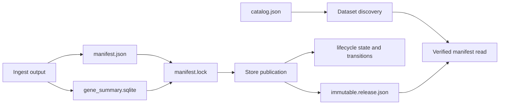

# Artifact and Store Contracts

Atlas publishes a dataset as an immutable manifest-and-SQLite pair addressed by
dataset identity. Integrity, discoverability, and publication state are related
contracts, but they are not interchangeable.

```mermaid
flowchart LR
    Ingest[Ingest output] --> Manifest[manifest.json]
    Ingest --> SQLite[gene_summary.sqlite]
    Manifest --> Lock[manifest.lock]
    SQLite --> Lock
    Lock --> Publish[Store publication]
    Publish --> Marker[immutable.release.json]
    Publish --> Lifecycle[lifecycle state and transitions]
    Catalog[catalog.json] --> Discover[Dataset discovery]
    Discover --> Read[Verified manifest read]
    Marker --> Read
```

## Dataset Layout

Each dataset uses the canonical `release/species/assembly` prefix. The store
contract recognizes:

| Path | Responsibility |
| --- | --- |
| `<dataset>/manifest.json` | versioned dataset identity, input and artifact hashes, statistics, provenance references, scientific metadata, and schema identities |
| `<dataset>/gene_summary.sqlite` | queryable serving payload |
| `<dataset>/manifest.lock` | SHA-256 values for the exact manifest and SQLite bytes |
| `<dataset>/immutable.release.json` | publication marker binding dataset and expected checksums |
| `<dataset>/lifecycle.state.json` | current lifecycle state |
| `<dataset>/lifecycle.transitions.json` | recorded publication transition history |
| `catalog.json` | sorted discoverability index for published dataset identities |

`.publish.lock` is an exclusive publication guard, not durable publication
evidence. Temporary files are written beneath the dataset's derived directory
and renamed into place before the directory is synchronized.

## Publication Invariants

For the local store, publication:

1. acquires the dataset publication lock;
2. rejects an existing marker, manifest, or SQLite payload;
3. checks caller-supplied manifest and SQLite hashes;
4. writes and synchronizes temporary payload and lock files;
5. renames them into the canonical layout;
6. writes the immutable marker and a `published` lifecycle transition.

The `ArtifactStore` trait calls this operation `put_dataset` and exposes
`publish_atomic` as a delegating default. Atomicity is bounded by the backend's
implementation and filesystem or object-store semantics; the method name alone
does not establish cross-system transactional publication.

## Read and Discovery Invariants

`get_manifest` for the local backend requires the manifest, SQLite payload, and
lock. It validates both lock hashes, decodes the manifest with unknown fields
denied, and applies strict manifest validation. `get_sqlite_bytes_verified`
also compares the SQLite bytes with the checksum recorded inside the manifest.

`list_datasets` reads `catalog.json` and enforces canonical sorted catalog
shape. Publishing a dataset through `put_dataset` does not update that catalog.
Catalog promotion is therefore a separate operation and proof boundary. A
payload can be published but not discoverable; a catalog entry is not proof
that the referenced payload passes integrity checks.

## Backend Boundaries

- `LocalFsStore` supports reads and immutable publication on a filesystem.
- `S3LikeStore` is feature-gated and carries object-store-specific publication
  and verification behavior.
- `HttpReadonlyStore` is feature-gated and read-only.

Backend selection must be compiled and configured explicitly. Shared trait
names do not imply identical atomicity, cache, retry, or consistency guarantees.

## Backup and Recovery Contract

A recoverable dataset includes the manifest, SQLite payload, lock, immutable
marker, lifecycle records, and the relevant catalog state. Recovery must
revalidate bytes and identity before restoring discoverability. Copying only
`catalog.json`, or only the SQLite file, does not reconstruct the publication
contract.

## Interpret Partial State

| Observed state | Safe interpretation | Required response |
| --- | --- | --- |
| candidate files exist without a lock | build output is incomplete or not yet integrity-bound | diagnose the build; do not publish by hand |
| payload and lock exist without an immutable marker | publication did not establish the durable completion boundary | retain diagnostics and retry through the owning publication operation |
| immutable marker exists but catalog entry is absent | payload may be published but is not discoverable | verify the complete payload, then perform governed promotion |
| catalog entry exists but verified read fails | discovery points at unavailable or inconsistent bytes | remove serving eligibility and repair catalog/store coherence |
| lifecycle state disagrees with marker or transition history | publication evidence is internally inconsistent | treat the dataset as non-promotable until reconciled |

Never repair partial state by inventing a marker, editing a hash, or copying a
catalog entry. Those actions manufacture the appearance of a completed
transition without recreating its validation and durability evidence.

## Change Review Boundary

Dataset prefixes, filenames, manifest fields, schema versions, checksum
semantics, and catalog ordering are machine-consumed compatibility surfaces.
Changes require coordinated ingest, store, runtime, backup, and recovery
review. Backend-specific atomicity, consistency, and retry behavior must be
documented beside any shared-trait claim rather than inferred from the local
filesystem implementation.
