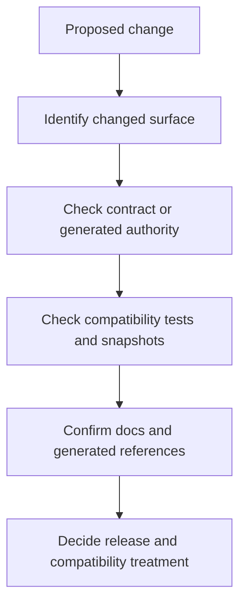

# Compatibility Review Checklist

Use this checklist when a change might alter a repository-owned Atlas promise.

## Review Flow

This page exists so compatibility review stays anchored to real artifacts
instead of memory or instinct.

## Review Questions

- does the change affect a documented API, config, output, or artifact rule
- is the behavior covered by compatibility or contract tests
- does release evidence need to call out the change explicitly
- are redirects, docs, and generated references still aligned

## Surface Checklist

- API surface: review the router, response contracts, and generated OpenAPI
- CLI surface: review the CLI adapter, the owned binary entrypoints, and any changed output contract
- runtime config surface: review config parsing, generated runtime config docs, and compatibility expectations
- schema or artifact surface: review the owning schema, snapshot, and any generated reference artifact
- docs URL surface: review redirects, moved pages, and any generated reference or navigation impact

## Outcome

The goal is to keep contract changes intentional, reviewable, and visible
before they escape as accidental drift.

## Main Takeaway

Compatibility review is only strong when a maintainer can point to the changed
surface, the artifact that proves it, and the release consequence that follows
from it.
