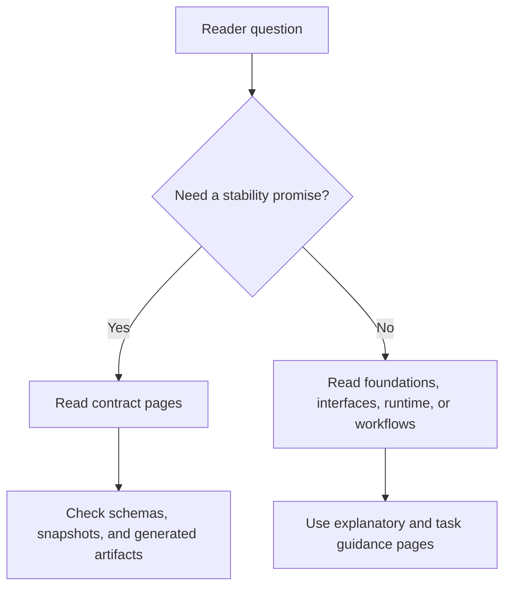

# Contract Reading Guide

Not every Atlas page makes the same strength of promise.

Use the contract slice when you need an intentional stability statement. Use
the foundations, workflows, interfaces, and runtime slices when you need
mental models, task guidance, or current architecture.

## Reading Strength Model

This page keeps the promise hierarchy clear. Atlas uses different
documentation slices for different strengths of promise, and the contract
slice is where stability claims become explicit.

## Contract Authority Map

- narrative contract meaning is explained in [`docs/bijux-atlas/contracts/`](/Users/bijan/bijux/bijux-atlas/docs/bijux-atlas/contracts)
- code-facing contract implementation lives under [`src/contracts/`](/Users/bijan/bijux/bijux-atlas/crates/bijux-atlas/src/contracts)
- machine-checked contract shape lives under [`configs/schemas/contracts/`](/Users/bijan/bijux/bijux-atlas/configs/schemas/contracts)
- generated API and runtime contract artifacts live under [`configs/generated/openapi/`](/Users/bijan/bijux/bijux-atlas/configs/generated/openapi) and [`configs/generated/runtime/`](/Users/bijan/bijux/bijux-atlas/configs/generated/runtime)

## Reading Rule

- if downstream integrations rely on it, read the contract page
- if the question is exact compatibility or versioning, stay here
- if the question is how to use the product, move back to repository workflows

## Main Takeaway

The contract slice is Atlas's explicit promise surface. Read it when the
question is compatibility, versioning, or relied-on shape; read the other docs
slices when the question is understanding, using, or navigating the product.
