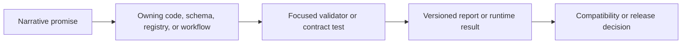
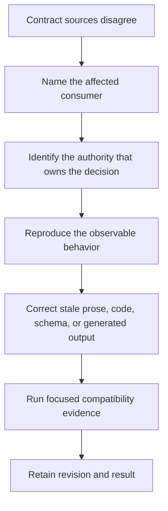

# Contract Reading Guide

Atlas contracts describe behavior that another component, operator, or client
may rely on. They must be read together with the authority that implements the
behavior and the evidence that verifies it.

```mermaid
flowchart LR
    Promise[Narrative promise] --> Authority[Owning code, schema, registry, or workflow]
    Authority --> Evidence[Focused validator or contract test]
    Evidence --> Observation[Versioned report or runtime result]
    Observation --> Decision[Compatibility or release decision]
```

## Four Layers of a Contract

| Layer | Question it answers | Typical Atlas source |
| --- | --- | --- |
| meaning | what consumers may rely on and what is excluded | pages in `docs/bijux-atlas/contracts/` |
| authority | which implementation or declaration owns the behavior | crate code, checked-in registries, workflow definitions, and operational manifests |
| shape | which fields, identifiers, and versions are machine-readable | `configs/schemas/contracts/`, generated OpenAPI, and runtime schemas |
| evidence | what was executed against which revision or target | focused tests and versioned reports under `artifacts/` |

These layers can disagree. A schema may accept data that the runtime rejects,
or generated OpenAPI may omit a live route. That is contract drift. Do not
resolve it by selecting whichever source is most convenient; identify the
owner, correct the disagreement, and retain evidence for the corrected path.

## Find the Right Contract

- HTTP clients start with [API Compatibility](api-compatibility.md) and the
  generated OpenAPI surface.
- automation consumers start with
  [Structured Output Contracts](structured-output-contracts.md) and the report
  registry.
- runtime configuration consumers start with
  [Runtime Config Contracts](runtime-config-contracts.md).
- artifact producers and stores start with
  [Artifact and Store Contracts](artifact-and-store-contracts.md).
- deployment and release consumers start with
  [Operational Contracts](operational-contracts.md).
- package owners start with
  [Ownership and Versioning](ownership-and-versioning.md).

Foundations explain the model, workflows teach procedures, interfaces describe
current commands and APIs, and runtime pages explain composition. Those pages
provide necessary context, but an explicit contract page defines the intended
stability boundary.

## Evaluate a Claim

1. Identify the exact consumer and observable behavior.
2. Locate the authority named by the contract.
3. Check its schema or versioned identity where one exists.
4. Find the focused test or validator and confirm what it actually exercises.
5. Bind retained output to the source revision, configuration, and external
   target.
6. Read exclusions and degraded modes before treating a green status as a
   broader guarantee.

## Evidence Strength

Configuration proves declared intent. A generated artifact proves derivation
from a source at a revision. A validator proves only its implemented checks. A
simulation proves model behavior under its fixture. A measured run proves an
observation against its named target. Publication proof requires a channel
receipt or immutable identity.

## When Authorities Disagree

```mermaid
flowchart TD
    Conflict[Contract sources disagree] --> Consumer[Name the affected consumer]
    Consumer --> Owner[Identify the authority that owns the decision]
    Owner --> Observe[Reproduce the observable behavior]
    Observe --> Correct[Correct stale prose, code, schema, or generated output]
    Correct --> Prove[Run focused compatibility evidence]
    Prove --> Record[Retain revision and result]
```

Do not average conflicting sources into a vague promise. Generated output may
be stale, a schema may be broader than runtime validation, and a test may cover
only one adapter. The owner is the surface that makes the disputed decision;
the other sources must either align with it or explicitly narrow their claim.

## Change Review Boundary

Contract meaning, machine-consumed fields, identifiers, and public locations
are compatibility surfaces. Explanatory prose may become clearer without
changing the promise, but a change to relied-on behavior requires the owning
compatibility process. Review the consumer-visible delta, not only the file
type or implementation diff that carried it.
