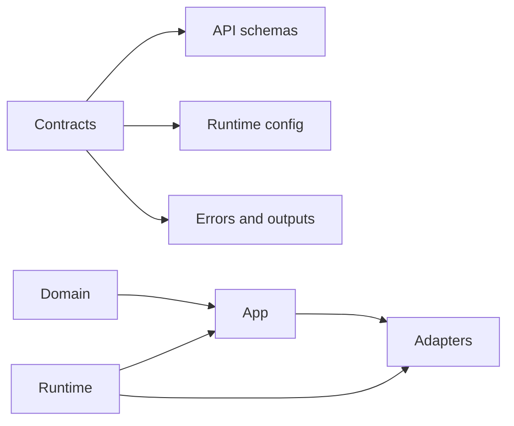
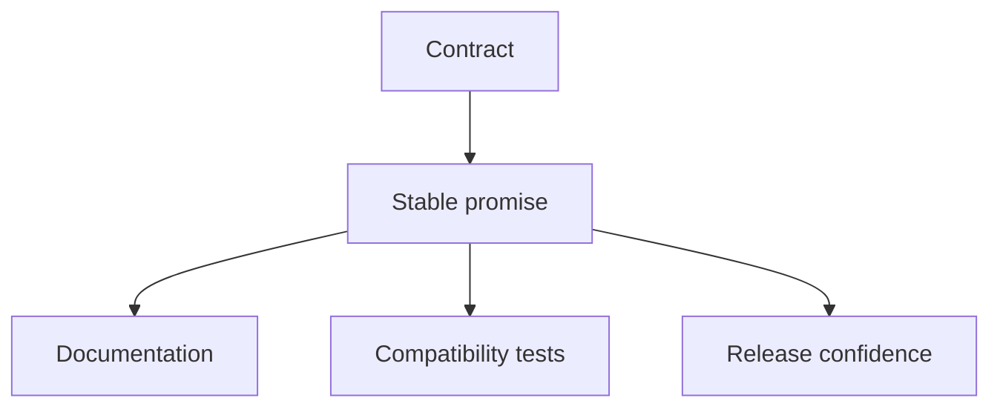

# Contracts and Boundaries

Atlas relies on boundaries to keep the codebase teachable and on contracts to
keep stable promises explicit.

## Boundary Model

This boundary model shows the relationship between code placement and stable
promises. Contracts define what outside consumers can rely on, while the
architectural layers decide where behavior should live internally.

## Contract Purpose

This contract-purpose diagram matters because a contract is more than a page in
the docs. It should connect documentation, enforcement, and release
confidence.

## The Main Architectural Idea

Boundaries decide where code should live.

Contracts decide what the outside world can rely on.

Those are related, but they are not the same thing.

## Typical Failure Modes

- duplicated contract ownership
- broad barrels hiding the real source of truth
- runtime or adapter logic bleeding into domain surfaces
- undocumented helper paths becoming accidental API

## Healthy Boundary Behavior

- ownership is obvious from the tree
- contracts have one owner path
- compatibility is test-backed
- internal refactors do not quietly redefine public promises

## Two Questions That Prevent Drift

- where should this code live?
- what, if anything, should an outside consumer be able to rely on?

Those questions sound similar, but Atlas treats them differently on purpose.

## Reading Rule

## Repository-Specific Boundary Failures

- domain logic placed in `src/adapters/` instead of `src/domain/`
- transport semantics from HTTP or CLI leaking into domain types
- runtime startup behavior being documented as if it were a public contract by
  default
- helper or generated artifact paths being treated as stable API without a
  contract owner

## Enforcement Anchors

- code placement boundaries: `crates/bijux-atlas/src/domain/`,
  `src/app/`, `src/adapters/`, `src/runtime/`
- stable contract implementation: `crates/bijux-atlas/src/contracts/`
- machine-checked shape: `configs/schemas/contracts/` and `configs/generated/`

## Main Takeaway

Atlas stays teachable when boundary rules answer “where should this live?” and
contracts answer “what may an outside consumer rely on?”. Mixing those two
questions is one of the fastest ways to create accidental public surfaces.

Use this page when a change is plausible in code but you still need to decide
whether it changes placement, public promises, or both.
