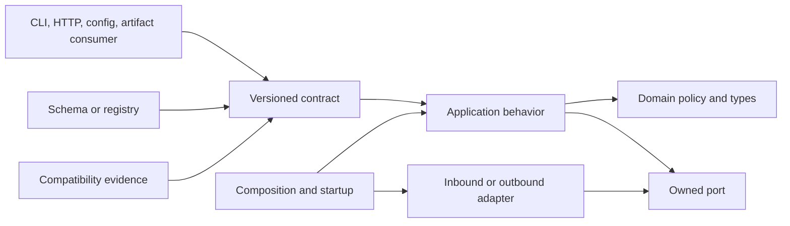

# Contracts and Boundaries

An architectural boundary answers where behavior is owned. A contract answers
what a consumer may rely on. Atlas uses both: boundaries keep implementation
dependencies legible, while contracts make compatibility and evidence
reviewable.

Boundaries are dependency rules. Contracts are consumer rules. Review both
when a change crosses ownership and alters observable behavior.

```mermaid
flowchart LR
    Consumer[CLI, HTTP, config, artifact consumer] --> Contract[Versioned contract]
    Contract --> App[Application behavior]
    App --> Domain[Domain policy and types]
    App --> Port[Owned port]
    Adapter[Inbound or outbound adapter] --> Port
    Runtime[Composition and startup] --> App
    Runtime --> Adapter
    Schema[Schema or registry] --> Contract
    Test[Compatibility evidence] --> Contract
```

## Runtime Code Boundaries

| Boundary | Responsibility | Must not become |
| --- | --- | --- |
| `domain/` | policy, security, and cluster concepts independent of transport | HTTP or CLI request handling |
| `app/` | use cases, cache and query coordination, and ports | concrete network or storage ownership |
| `adapters/outbound/` | implementations of external storage and service ports | the source of domain rules |
| `runtime/` | configuration, composition, packaged state, and lifecycle | an accidental public API merely because startup uses it |
| server inbound adapters | HTTP routing, middleware, request policy, and response translation | domain semantics duplicated at the transport edge |
| `contracts/` | explicitly exported config artifacts and machine error shapes | a catch-all for internal helpers |

The server crate also has its own `app/` and inbound/outbound adapter split.
Crate ownership matters alongside directory naming. The runtime library owns
reusable runtime behavior. The server owns HTTP hosting and target-bound
composition.

## Contract Authorities

Atlas contracts appear in several forms:

- Clap surfaces and structured CLI output;
- HTTP routes, OpenAPI, status codes, headers, and error envelopes;
- environment variables, config files, defaults, and generated schemas;
- dataset manifests, reports, release evidence, and other versioned artifacts;
- governance registries that bind IDs to owners, runners, suites, and report
  paths.

No directory makes a surface stable by itself. `configs/schemas/contracts/`
contains machine-readable authorities, while `configs/generated/` contains
derived indexes and snapshots. A schema proves shape only when a producer or
validator applies it. A registry row proves declaration. Its enforcement
depends on a live runner and evidence path.

## Classify a Change

Ask these questions in order:

1. Which component owns the behavior?
2. Which consumer observes the change?
3. What is the exact authority: code, schema, registry, or generated mirror?
4. Which compatibility rule applies?
5. Which focused evidence proves the old and new behavior?

An internal refactor can cross directories without changing a consumer
contract. Dependency direction and public behavior must remain intact. A
one-line default, field, route, error, or exit-code change can still be a
breaking contract event.

## Failure Patterns

- transport types leaking into domain policy;
- application code depending directly on a replaceable adapter;
- duplicate contract ownership across code and generated files;
- undocumented helper output becoming a machine consumer's de facto API;
- a generated snapshot being edited instead of its authority;
- a schema cited as enforcement when no runtime or validator evaluates it; and
- a broad passing suite used to claim a contract it did not select.

A healthy change leaves one durable owner, an explicit consumer promise, a
coordinated compatibility decision, and evidence whose scope matches the
claim.
