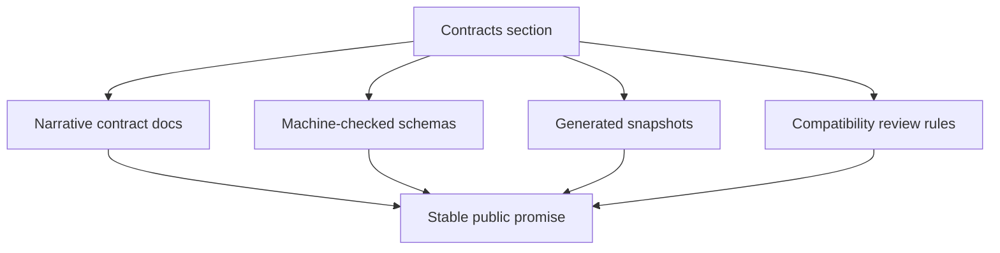

# Contracts

`bijux-atlas/contracts` is where Atlas turns documented intent into a
checkable public promise.

This section explains where Atlas turns “we intend this to stay stable” into a
checkable promise. Narrative docs, schemas, snapshots, and review rules all
matter, but they do different jobs.

Use this section when the question is about what Atlas is intentionally trying
to keep stable for downstream users, operators, or automation consumers.

## What Belongs Here

- API compatibility promises
- runtime configuration and structured-output commitments
- plugin, artifact, and ownership boundaries
- the review rules used before changing a documented surface

## Human Docs Versus Machine Contracts

- narrative contract pages explain meaning, scope, and compatibility posture
- schemas under `configs/schemas/contracts/` define machine-checkable shape
- generated artifacts under `configs/generated/` act as comparison points for
  drift and compatibility review
- code under `crates/bijux-atlas/src/contracts/` and neighboring runtime or
  adapter code is where the contract is implemented

## Reading Rule

Read this section after you already understand the product model or workflow.
Contract pages are strongest when they sit on top of a clear mental model:

- start in [Foundations](../foundations/index.md) if the meaning of the surface is still unclear
- start in [Interfaces](../interfaces/index.md) if you first need to see the exact CLI, API, or config surface
- stay here when you need to decide whether a change is compatible, additive, or breaking

If the question is only “what command or endpoint does this?”, contracts are
too early. Come here once the question becomes “what are we promising to keep
stable?”

## Suggested Entry Points

- overall boundary and reading posture: [Contracts and Boundaries](contracts-and-boundaries.md)
- versioning and ownership expectations: [Ownership and Versioning](ownership-and-versioning.md)
- API-facing compatibility: [API Compatibility](api-compatibility.md)
- compatibility review discipline: [Compatibility Review Checklist](compatibility-review-checklist.md)

## Pages

- [API Compatibility](api-compatibility.md)
- [Artifact and Store Contracts](artifact-and-store-contracts.md)
- [Compatibility Review Checklist](compatibility-review-checklist.md)
- [Contract Reading Guide](contract-reading-guide.md)
- [Contracts and Boundaries](contracts-and-boundaries.md)
- [Operational Contracts](operational-contracts.md)
- [Ownership and Versioning](ownership-and-versioning.md)
- [Plugin Contracts](plugin-contracts.md)
- [Runtime Config Contracts](runtime-config-contracts.md)
- [Structured Output Contracts](structured-output-contracts.md)

## What You Should Know Before Leaving

After using this section, you should be able to say:

- whether the surface is covered by a documented contract
- what kind of compatibility expectation applies
- which adjacent tests, docs, redirects, or release notes need to move with the change
