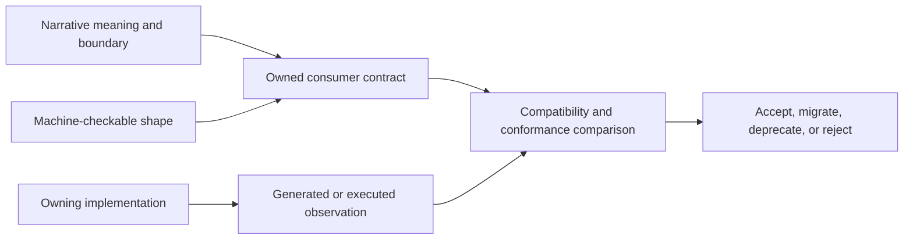

# Contracts

Atlas contracts define what consumers may rely on, who owns the promise, how a
change is classified, and what evidence demonstrates conformance. Narrative,
schemas, generated references, implementation, and compatibility policy have
different roles; trust depends on keeping them aligned.

```mermaid
flowchart LR
    Meaning[Narrative meaning and boundary] --> Contract[Owned consumer contract]
    Schema[Machine-checkable shape] --> Contract
    Implementation[Owning implementation] --> Observed[Generated or executed observation]
    Contract --> Compare[Compatibility and conformance comparison]
    Observed --> Compare
    Compare --> Decision[Accept, migrate, deprecate, or reject]
```

## Contract Directory

| Surface | Contract | Primary consumer risk |
| --- | --- | --- |
| HTTP and OpenAPI | [API Compatibility](api-compatibility.md) | route, parameter, status, or payload incompatibility |
| CLI and report JSON | [Structured Output Contracts](structured-output-contracts.md) | silent field, type, version, or error-code drift |
| runtime configuration | [Runtime Config Contracts](runtime-config-contracts.md) | changed precedence, default, validation, or secret handling |
| artifacts, catalog, and stores | [Artifact and Store Contracts](artifact-and-store-contracts.md) | ambiguous release identity or unreadable immutable state |
| plugins | [Plugin Contracts](plugin-contracts.md) | unsupported capability or lifecycle assumptions |
| health, telemetry, rollout, and recovery | [Operational Contracts](operational-contracts.md) | unsafe traffic, promotion, or recovery decisions |
| crate and surface ownership | [Ownership and Versioning](ownership-and-versioning.md) | depending on an alias, adapter, or internal owner by mistake |

## Strength and Authority

| Artifact | Establishes | Does not establish alone |
| --- | --- | --- |
| narrative contract | meaning, scope, and compatibility intent | executable conformance |
| schema or policy | accepted shape and decision rule | behavior of a candidate |
| generated reference | resolved surface for recorded inputs | public stability without ownership policy |
| example or fixture | representative encoding or workflow | current release behavior |
| implementation test | behavior exercised at a source revision | deployed or distributed artifact identity |
| release-bound report | observed result for named artifacts and environment | behavior outside its recorded scope |

## Change Classification

A change is compatible only under the policy of its owning surface. Adding an
optional JSON field may be compatible where consumers ignore unknown fields,
while adding a required configuration key is not. A clearer error message may
be compatible, while reusing its machine error code for new meaning is not.

Before changing a contract:

1. identify the owner, consumers, and applicable version policy;
2. compare narrative, schemas, implementation, generated references, and
   examples for drift;
3. classify forward and reverse compatibility;
4. provide migration, deprecation, or rejection behavior where required;
5. regenerate governed references and run the narrow conformance evidence; and
6. record the change in the release material consumed by affected users.

Use [Contracts and Boundaries](contracts-and-boundaries.md) and the
[Contract Reading Guide](contract-reading-guide.md) for the authority model.
Use the [Compatibility Review Checklist](compatibility-review-checklist.md) for
change review. Product meaning is under [Foundations](../foundations/index.md),
and exact consumer surfaces are under [Interfaces](../interfaces/index.md).
