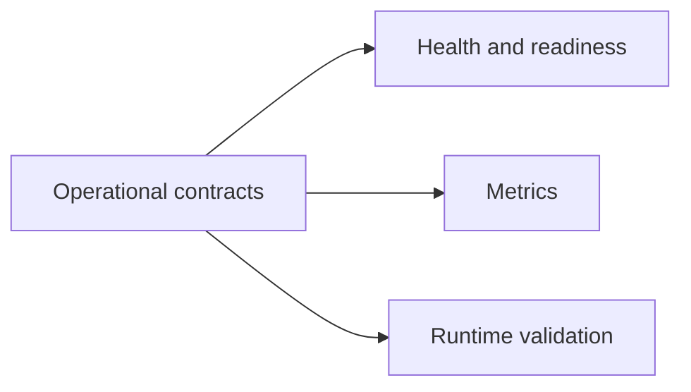
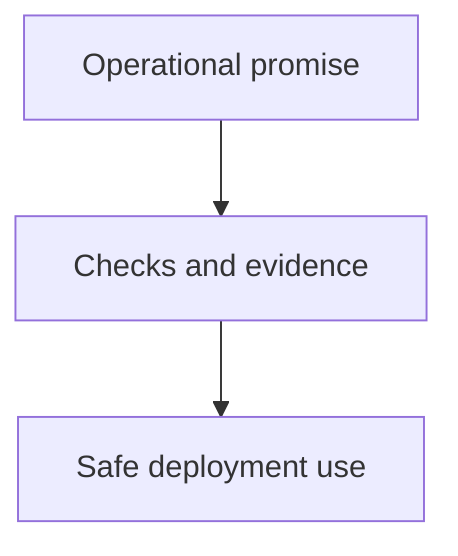

# Operational Contracts

Operational contracts define the stable expectations operators can rely on
around health, readiness, observability, and runtime behavior.

## Operational Contract Scope

This operational-scope diagram shows the stable operator-facing surfaces Atlas
expects deployments to rely on intentionally.

## Operator Promise Model

This promise model explains how operational contracts stay credible: they must
connect to checks and evidence that operators can actually use during
deployment and recovery.

## Main Promise Areas

- health and readiness semantics
- metrics and observability surfaces
- runtime validation behavior
- explicit operator-visible error conditions

## Reading Rule

Use this page when a deployment surface looks stable in practice and you need
to confirm whether Atlas treats it as an operator-facing promise.
