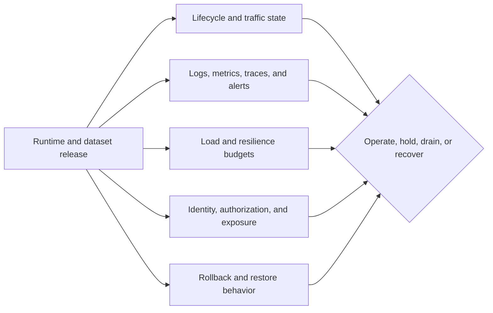
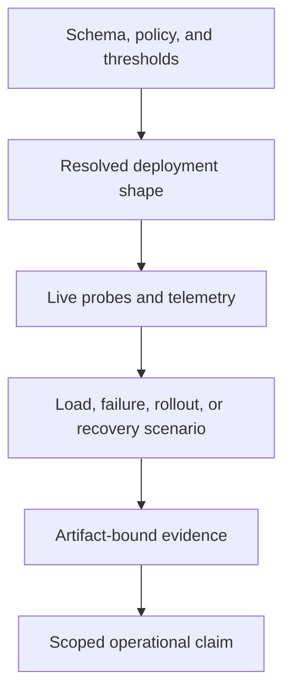

# Operational Contracts

Operational contracts define the signals, states, limits, and recovery
behavior used to admit traffic and make rollout, incident, capacity, and
release decisions. They are consumer promises to operators, not informal
observations that happened to remain stable.

## Decision Surface

```mermaid
flowchart LR
    Runtime[Runtime and dataset release] --> Health[Lifecycle and traffic state]
    Runtime --> Signals[Logs, metrics, traces, and alerts]
    Runtime --> Capacity[Load and resilience budgets]
    Runtime --> Security[Identity, authorization, and exposure]
    Runtime --> Recovery[Rollback and restore behavior]
    Health --> Decision{Operate, hold, drain, or recover}
    Signals --> Decision
    Capacity --> Decision
    Security --> Decision
    Recovery --> Decision
```

## Promise Areas

| Area | Operator may rely on | Evidence required for a deployment claim |
| --- | --- | --- |
| liveness | process lifecycle can be distinguished from traffic readiness | probe history and process events |
| readiness and drain | endpoint membership reflects intentional traffic admission | readiness transitions and service membership |
| overload | protected cheap work and explicit shedding have governed semantics | request-class results, saturation, and overload signals |
| telemetry | signal names, labels, fields, spans, rules, and correlation are owned | freshness, continuity, retention, and drill evidence |
| security | identity, authorization, route registration, network, and workload controls fail within defined boundaries | rendered posture plus positive and negative checks |
| capacity | named workloads have absolute and regression budgets | comparable run with required metrics and baseline |
| rollout and recovery | promotion, rollback, and restore have explicit gates and identities | lifecycle, traffic, correctness, and cleanup evidence |

## Contract Layers

An operational schema or policy defines required shape. A rendered manifest
shows the selected deployment request. A probe or telemetry sample observes one
window. A scenario report exercises named behavior. A verified release packet
binds those observations to distributed artifacts. These layers must not be
collapsed into a single `ok` status.

```mermaid
flowchart TD
    Policy[Schema, policy, and thresholds] --> Render[Resolved deployment shape]
    Render --> Observe[Live probes and telemetry]
    Observe --> Exercise[Load, failure, rollout, or recovery scenario]
    Exercise --> Bind[Artifact-bound evidence]
    Bind --> Claim[Scoped operational claim]
```

## Change Rules

Treat changes to endpoint meaning, traffic admission, metric or label
semantics, log fields, span identity, error classification, thresholds,
security posture, rollout triggers, or recovery acceptance as operational
contract changes. Review affected dashboards, alerts, runbooks, automation,
profiles, scenarios, and release evidence together.

An additive signal is not harmless when it creates unbounded cardinality or
changes alert routing. A more permissive readiness check is not compatible when
it admits traffic before required data is usable. A faster rollback is not
safe when it skips compatibility or cleanup proof.

Detailed operator contracts live in the
[Operations handbook](../../bijux-atlas-ops/index.md). Exact endpoints and
configuration inputs live under [Interfaces](../interfaces/index.md).
