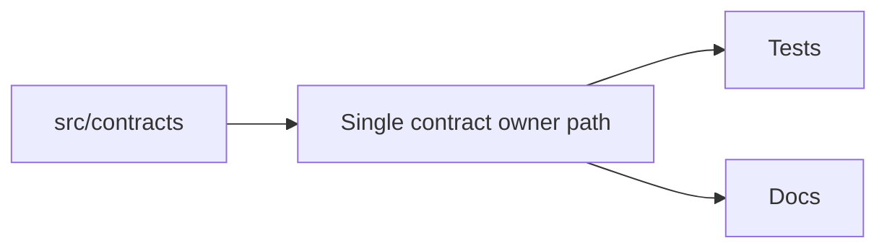
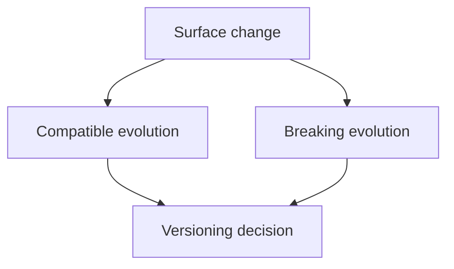

# Ownership and Versioning

Ownership and versioning contracts explain how Atlas keeps stable promises tied to one obvious owner path and evolves them intentionally.

## Ownership Model

This ownership model shows the minimum stable shape Atlas wants for a real
contract: one owner path, plus tests and docs that reinforce the same
boundary.

A stable surface should have one obvious owner in practice, not just in theory. In this repository that usually means some combination of:

- canonical docs with explicit `owner` metadata
- contract or schema files under the owning tree
- tests or checks that enforce the same boundary
- review ownership such as `.github/CODEOWNERS` when human approval matters

## Versioning Logic

This versioning logic keeps compatibility classification visible. The purpose
is to make evolution intentional rather than retroactively explained.

## Change Classes

- internal-only change: no documented contract or compatibility surface changes
- compatible surface change: documented surface expands without breaking current consumers
- breaking change: route, schema, config, output, or URL behavior changes in ways existing consumers would notice

Breaking changes should be rare, explicit, and accompanied by migration guidance.

## Deprecation Discipline

Atlas should not remove or rename stable surfaces casually. The current compatibility policy in
`configs/sources/governance/governance/compatibility.yaml` defines deprecation windows of:

- 180 days for env keys, chart values, profile keys, and report schemas
- 365 days for docs URLs

That policy matters because versioning is not only about semver labels. It is also about whether
real users, operators, and maintainers have enough time and documentation to move safely.

## Main Promise

Atlas should not hide stable truth behind multiple competing roots. If a contract is real, it should have one obvious owner and an intentional versioning story.

## Practical Rule

If you cannot answer all three questions clearly, the surface is not ready to be treated as stable:

1. Who owns it?
2. Where is it documented?
3. What is the versioning or deprecation path if it changes?

## Reading Rule

Use this page when a surface looks important enough to stabilize and you need
to decide who owns it and how it can change over time.
