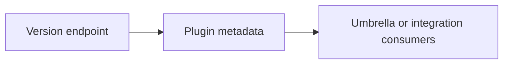
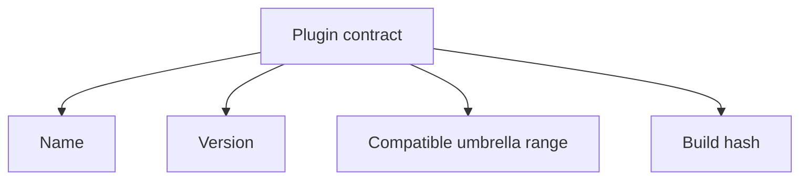

# Plugin Contracts

Plugin contracts define the metadata and compatibility information Atlas
exposes for integration-aware consumers.

## Plugin Metadata Model

This metadata model shows the integration-facing surface clearly. Plugin
identity exists so umbrella tools and other consumers can reason about Atlas
compatibility without reading source code.

## Contract Focus

This focus diagram lists the contract fields integrators care about most when
deciding whether a plugin instance is compatible and identifiable.

## Main Promise

Atlas should expose plugin identity and compatibility metadata in a form that external integrators can reason about without reading internal source code.

## Reading Rule

Use this page when another tool needs to reason about Atlas identity and
compatibility without inspecting the source tree directly.
