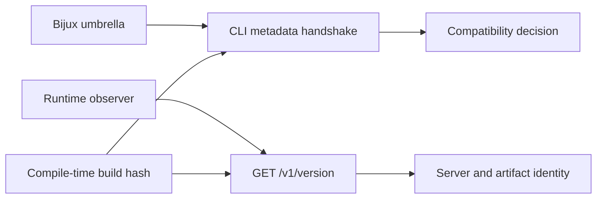

# Plugin Contracts

Atlas exposes machine-readable identity for the Bijux umbrella and other
integration-aware consumers. The product CLI handshake and the server version
endpoint overlap, but they are different payloads with different purposes.

## CLI Handshake

```bash
bijux-atlas --bijux-plugin-metadata
```

The command exits after writing JSON. Its versioned payload contains:

| Field | Meaning |
| --- | --- |
| `schema_version` | plugin metadata shape, currently `v1` |
| `name` | stable plugin identity, `bijux-atlas` |
| `version` | semantic product version |
| `version_display` | display version with its resolved source convention |
| `compatible_umbrella_min` | declared inclusive lower bound, `0.3.0` |
| `compatible_umbrella_max_exclusive` | declared exclusive upper bound, `0.4.0` |
| `compatible_umbrella` | human-readable range, `>=0.3.0,<0.4.0` |
| `build_hash` | build identity, or `unversioned` when `BIJUX_BUILD_HASH` was absent at compile time |

`--json` selects compact canonical JSON; without it, the same object is pretty
printed. Integrators should parse fields rather than depend on whitespace or
key order.

## Compatibility Gate

An umbrella can pass its version before invoking a product command:

```bash
bijux-atlas --umbrella-version 0.3.7 version
```

An incompatible value produces the machine error code
`umbrella_incompatible` and usage exit code `2`, including the received value
and declared bounds.

The current gate is less precise than the advertised range: it splits on dots
and accepts any value whose first two components are `0` and `3`. It does not
perform semantic-version parsing or enforce patch and prerelease semantics.
Consumers may use the advertised bounds for selection, but must not describe
the executable gate as a complete SemVer range check until that implementation
is tightened.

## Server Identity

`GET /v1/version` returns a versioned API envelope with a smaller `plugin`
object—name, display version, range string, and build hash—and a `server` object
containing crate identity, API and config schema versions, runtime policy hash,
and artifact schema versions. The response is publicly cacheable for 30
seconds.


```mermaid
flowchart LR
    Umbrella[Bijux umbrella] --> CLI[CLI metadata handshake]
    CLI --> Compat[Compatibility decision]
    Operator[Runtime observer] --> HTTP[GET /v1/version]
    HTTP --> Runtime[Server and artifact identity]
    Build[Compile-time build hash] --> CLI
    Build --> HTTP
```

Do not substitute the HTTP payload for the CLI handshake: the HTTP plugin
object omits the metadata schema version, explicit lower and upper fields, and
`version_display`. Conversely, the CLI handshake does not describe a running
server's runtime-policy or artifact-schema state.

Changes to field names, version meaning, compatibility bounds, error code,
exit behavior, or build-hash derivation are integration contract changes. Keep
the CLI tests, server response snapshot, umbrella consumer, and documentation
coordinated.
