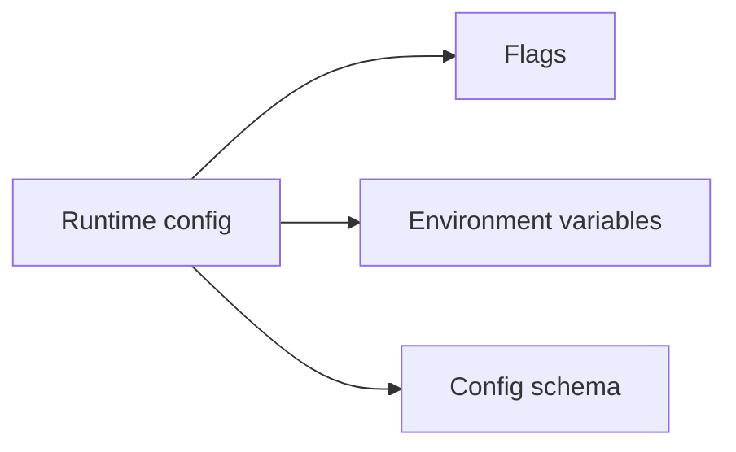
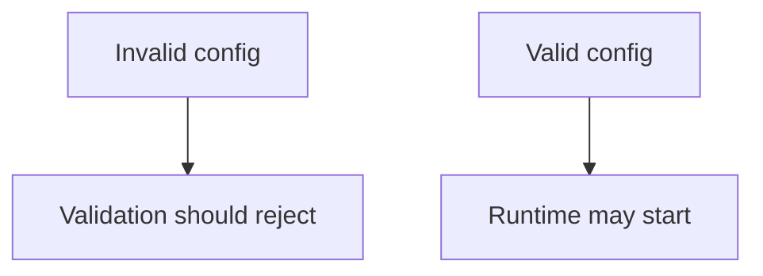

# Runtime Config Contracts

Runtime config contracts define the stable expectations around server
configuration inputs and validation behavior.

## Runtime Config Contract Scope

This scope diagram shows the parts of runtime configuration Atlas treats as
contract-sensitive: documented flags, supported environment variables, and
configuration-schema behavior.

## Contract Logic

This contract logic emphasizes fail-closed validation. Atlas should reject
malformed or contradictory runtime input rather than silently inventing a
meaning for it.

## Main Promise

Atlas should validate explicit runtime configuration rather than silently accepting malformed or contradictory input.

## Reading Rule

Use this page when runtime startup accepts or rejects configuration in a way
that might affect what operators can rely on across releases.
