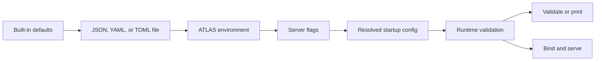
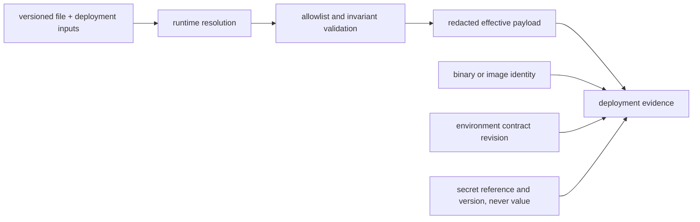

# Runtime Config Contracts

Atlas server startup combines a small file-backed startup contract with a
larger environment-backed runtime contract. The server resolves, validates,
and logs the effective configuration before binding its listener.

## Startup Resolution

Three startup fields accept four sources with deterministic precedence:

| Field | CLI | Environment | File key | Default |
| --- | --- | --- | --- | --- |
| bind address | `--bind` | `ATLAS_BIND` | `bind_addr` | `0.0.0.0:8080` |
| store root | `--store-root` | `ATLAS_STORE_ROOT` | `store_root` | `artifacts/server-store` |
| cache root | `--cache-root` | `ATLAS_CACHE_ROOT` | `cache_root` | `artifacts/server-cache` |


```mermaid
flowchart LR
    Defaults[Built-in defaults] --> File[JSON, YAML, or TOML file]
    File --> Env[ATLAS environment]
    Env --> CLI[Server flags]
    CLI --> Resolve[Resolved startup config]
    Resolve --> Validate[Runtime validation]
    Validate --> Inspect[Validate or print]
    Validate --> Start[Bind and serve]
```

The precedence is `CLI > environment > config file > defaults`. The
`--config` extension selects JSON, YAML, or TOML parsing; other extensions are
rejected. The three resolved values must be non-empty. Relative store and cache
paths resolve against the repository root embedded from the runtime crate's
build layout, not the process working directory or config-file directory.

## Runtime Validation

After startup resolution, `RuntimeConfig::from_env` parses the remaining
`ATLAS_*` variables and validates cross-field invariants. Examples include:

- numeric, Boolean, duration, sampling-rate, log-level, and exporter formats;
- mutually exclusive authentication modes and required credentials;
- cached-only readiness constraints;
- positive warm-coordination leases and retry budgets; and
- production requirements for a non-loopback bind, Redis, and configured auth
  material where the selected mode needs it.

Invalid typed values or contradictory combinations fail before the listener is
bound. Socket syntax itself is parsed later, immediately before bind, so a
non-empty but invalid `bind_addr` can pass config construction and still fail
server startup.

Runtime construction also validates environment-variable names against the
generated allowlist. Unknown `ATLAS_*` and `BIJUX_*` names fail closed. The
`ATLAS_DEV_ALLOW_UNKNOWN_ENV` escape hatch exists only for local development;
using it in a deployment removes typo detection from the admission boundary.

## Validate and Inspect

```bash
bijux-atlas-server --config atlas.toml --validate-config
bijux-atlas-server --config atlas.toml --print-effective-config
```

Both paths load the full environment-backed runtime configuration. Validation
returns before listener startup. Effective-config output has schema version 1,
identifies itself as `atlas_server_effective_config_v2`, and redacts known
Redis, API-key, HMAC, token, and store bearer fields. It is a diagnostic
snapshot, not safe permission to expose arbitrary future config fields; review
redaction whenever secret-bearing fields are added.

## Preserve configuration evidence

The effective payload records resolved values, but it does not attribute each
value to CLI, environment, file, or default. Redaction also deliberately
removes the secret material needed to reproduce authentication. A deployment
record therefore needs more than the printed payload.


```mermaid
flowchart LR
    Sources["versioned file + deployment inputs"] --> Resolve["runtime resolution"]
    Resolve --> Validate["allowlist and invariant validation"]
    Validate --> Effective["redacted effective payload"]
    Effective --> Record["deployment evidence"]
    Image["binary or image identity"] --> Record
    Contract["environment contract revision"] --> Record
    SecretRef["secret reference and version, never value"] --> Record
```

Retain the redacted effective payload with the binary or image identity, the
versioned non-secret configuration reference, the environment-contract
revision, and secret identifiers or versions. Never place secret values in the
evidence packet. This distinguishes “the process accepted these resolved
settings” from the stronger claim that operators can explain where each
setting came from.

## Schema Boundary

The generated startup schema is
`configs/generated/runtime/runtime-startup-config.schema.json`, produced from
the runtime contract code and guarded by drift tests. It describes the three
file-backed fields, defaults, and resolution order, with
`additionalProperties: false`.

The runtime file deserializer does not currently deny unknown fields and does
not run that JSON Schema. An unknown key can therefore be ignored at startup
even though it is invalid under the published schema. Validate configuration
files against the schema in deployment tooling when strict typo detection is
required, and do not claim that `--validate-config` enforces
`additionalProperties: false` until runtime parsing is wired accordingly.

Changing a flag, environment variable, default, precedence rule, validation
invariant, redaction rule, or generated schema changes operator behavior. Treat
each as a contract change and coordinate code, generated artifacts, deployment
configuration, examples, and compatibility evidence.
