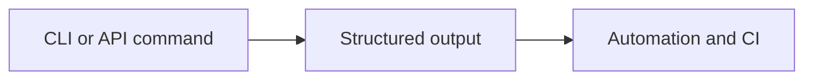
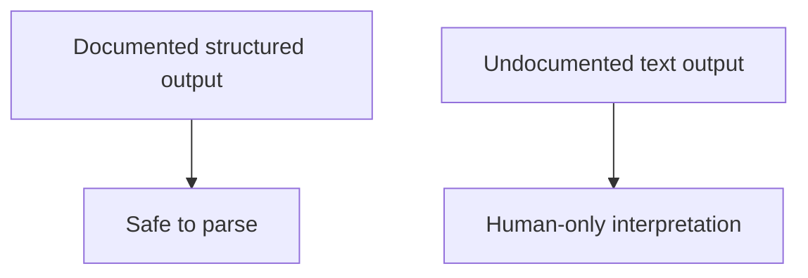

# Structured Output Contracts

Structured output contracts define which machine-readable outputs are meant to
be stable enough for automation.

## Output Contract Model

This output-contract diagram shows why structured output deserves its own
contract page. It is the surface automation should parse when Atlas explicitly
documents it as stable.

## Stability Logic

This stability logic keeps the parsing rule simple: documented structured output is the contract,
while human-readable text remains descriptive.

## Main Promise

If Atlas documents a structured output surface and tests it, automation should prefer that surface over screen-scraped human text.

## Stability

Only structured outputs that Atlas documents as contracts should be treated as
stable automation inputs. Human-readable text remains descriptive and may
change without compatibility guarantees.

## Reading Rule

Use this page when Atlas exposes both human-readable text and structured data
and the real question is which one automation may safely parse.
