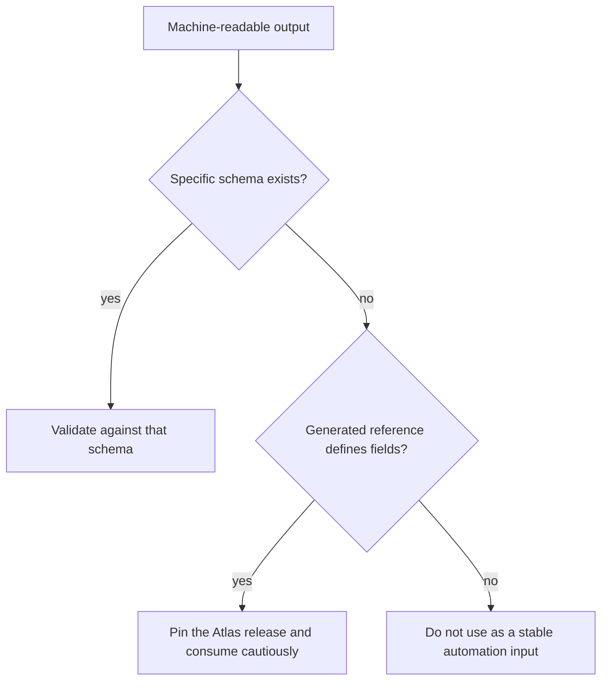
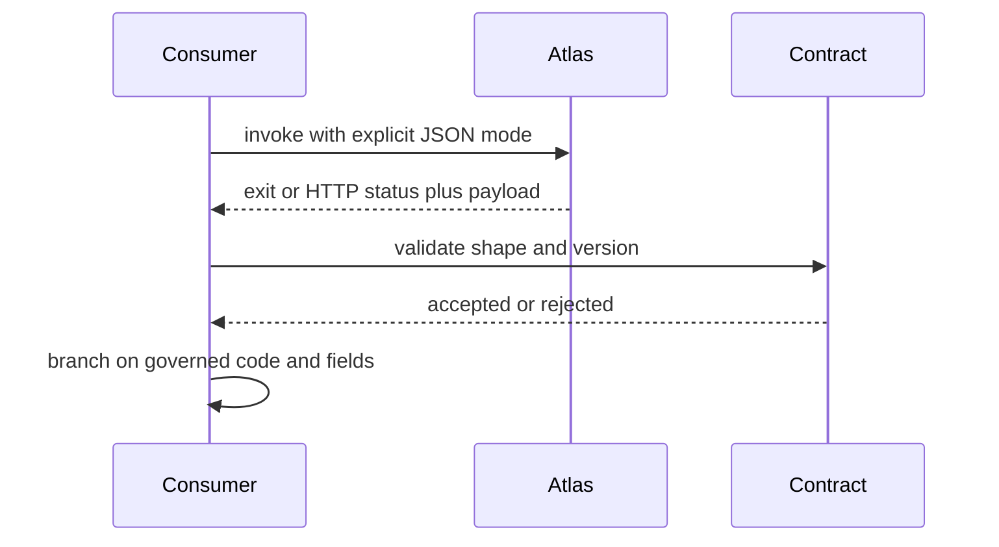

# Structured Output Contracts

Atlas emits JSON across product and maintainer interfaces, but JSON syntax by
itself is not a compatibility contract. Automation may rely only on the fields,
types, meanings, and version rules governed for the exact command, endpoint, or
report it consumes.

## Choose the Exact Contract

```mermaid
flowchart TD
    Output[Machine-readable output] --> Schema{Specific schema exists?}
    Schema -- yes --> Validate[Validate against that schema]
    Schema -- no --> Reference{Generated reference defines fields?}
    Reference -- yes --> Pin[Pin the Atlas release and consume cautiously]
    Reference -- no --> Human[Do not use as a stable automation input]
```

Atlas has multiple output families rather than one universal envelope. Query
results, ingest records, release manifests, CI run reports, tutorial evidence,
and operational reports each have their own ownership and may have different
required fields. Never infer a global payload shape from one command.

The contract schemas under `configs/schemas/contracts/` are the source of
authority for governed report and artifact shapes. Generated CLI, API, and
configuration references describe the surfaces produced from source code and
registries. Examples demonstrate use, but do not add fields to a contract.

## Product CLI Encoding

The `bijux-atlas` CLI writes JSON for command results. Output mode changes the
encoding, not the domain meaning:

| Invocation | Encoding | Intended consumer |
| --- | --- | --- |
| default | indented JSON | a person inspecting a result |
| `--json` | canonical compact JSON followed by a newline | scripts, pipelines, and captured evidence |
| `--quiet` | suppresses normal success output where the command supports it | workflows that depend on exit status |

Use `--json` for automation. Do not parse indentation, key order in
human-oriented output, help text, diagnostics, or log messages. Diagnostics
belong on their documented stream and are not part of the success payload.

## Version Fields Are Local to a Contract

`schema_version` is not a repository-wide scalar type. Existing governed and
generated surfaces include integer versions, numeric strings, and identifiers
such as `v1`. A consumer must validate the value exactly as the owning schema
defines it.

Do not coerce these forms into one private convention. Silent coercion can make
an incompatible payload appear valid and conceal which contract produced it.
When no schema governs a version field, pin the producer release and treat the
shape as provisional.

## Consumption Rules

For each machine-consumed output:

1. identify the command, endpoint, report, or artifact family;
2. locate its specific schema or generated reference;
3. validate required fields and exact types before using the payload;
4. interpret process exit status or HTTP status together with the payload;
5. reject unsupported contract versions explicitly;
6. retain producer version and run or release identity with evidence;
7. ignore additional fields only when the schema permits them.

A payload containing `"status": "ok"` proves only what that contract assigns
to the field. It does not by itself prove completeness, conformance, promotion
readiness, or artifact integrity.

## Error Handling

Machine consumers should branch on documented error codes and structured
fields, then use the process exit status or HTTP status as the transport-level
outcome. Message text is for diagnosis and may become clearer without a
compatibility event.

```mermaid
sequenceDiagram
    participant Consumer
    participant Atlas
    participant Contract
    Consumer->>Atlas: invoke with explicit JSON mode
    Atlas-->>Consumer: exit or HTTP status plus payload
    Consumer->>Contract: validate shape and version
    Contract-->>Consumer: accepted or rejected
    Consumer->>Consumer: branch on governed code and fields
```

If output is truncated, mixed with unrelated text, fails schema validation, or
uses an unsupported version, treat the entire result as invalid. Recover from
the original command or retained artifact; do not repair evidence in place.

## Contract Change

Changes to governed structured outputs follow the repository compatibility
policy. Additive change is compatible only when the owning schema permits
additional fields and consumers were instructed to ignore them. Removing a
field, changing its type or meaning, reusing a code, or changing version
semantics requires explicit compatibility treatment.

For the stability hierarchy behind these rules, see
[Guarantees and Stability](../foundations/guarantees-and-stability.md). For API
payloads, use the generated OpenAPI contract as the authority.
