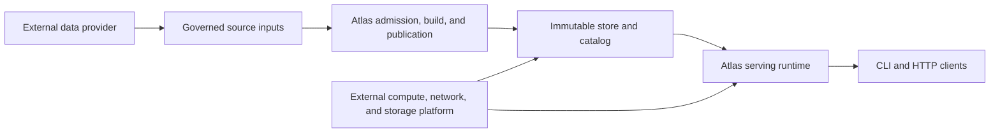
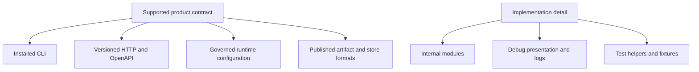

# Boundaries and Non-Goals

Atlas owns the conversion of supported genomic inputs into immutable release
artifacts and the contract-backed delivery of those releases. It depends on
upstream data providers and deployment infrastructure without claiming their
correctness as its own.

## Atlas System Boundary

| Boundary | Atlas owns | Atlas requires but does not own |
| --- | --- | --- |
| source | supported format validation, input identity, provenance capture, and admission result | biological correctness, provider availability, and upstream curation decisions |
| build | normalization, artifact construction, manifest generation, and verification | host resources and tool availability named by the build contract |
| publication | immutable payload layout, integrity checks, and catalog promotion semantics | durability and availability supplied by the configured storage platform |
| serving | dataset resolution, query semantics, API shape, errors, and runtime telemetry | network, scheduler, volume, and identity services supplied by the deployment platform |
| operations | chart, profile, policy, evidence, and rollback contracts shipped by Atlas | an operator's environment, credentials, capacity, and incident authority |

An external dependency can fail inside an Atlas workflow without becoming an
Atlas-owned guarantee. Atlas must detect, classify, and expose the failure at
its boundary; it cannot prove the external system's correctness.

## Public Boundary Model

A checked-in path is not automatically public. Consumers may rely on installed
commands, versioned API and schema contracts, documented configuration, and
published artifact formats within their stated stability class. Internal Rust
modules, test fixtures, debug messages, and repository-maintenance commands do
not become product API merely because they are visible in the repository.

## What Atlas Is Not Trying to Be

Atlas is not:

- a general ETL framework.
- a generic workflow runner.
- a mutable operational database where runtime writes redefine release state.
- a shell-script-first control plane.
- a compatibility promise for every internal Rust path or log line.
- a claim that local shortcuts and production workflows are interchangeable.

## Boundary Test

Classify a proposed dependency or behavior before treating it as stable:

1. Name the object: source, candidate, artifact, catalog entry, request,
   runtime state, or operational evidence.
2. Name its owner and governing artifact: crate, schema, generated contract,
   chart, policy, or runbook.
3. Identify who may change it: producer, Atlas, operator, or external platform.
4. State the failure behavior at the boundary and the evidence that exposes it.
5. Depend only on the subset explicitly covered by a public stability class.

If no authority or failure contract can be named, the behavior is incidental.
It should not become a compatibility dependency.

Continue with [Guarantees and Stability](guarantees-and-stability.md) for the
public stability classes and [Package Ownership](package-ownership.md) for the
crate and control-plane split.
