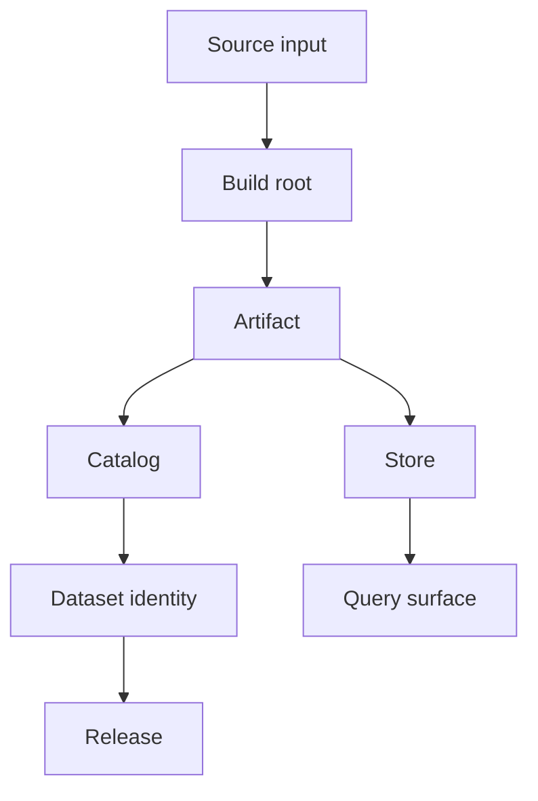
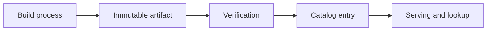
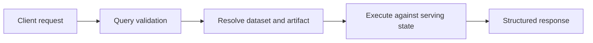
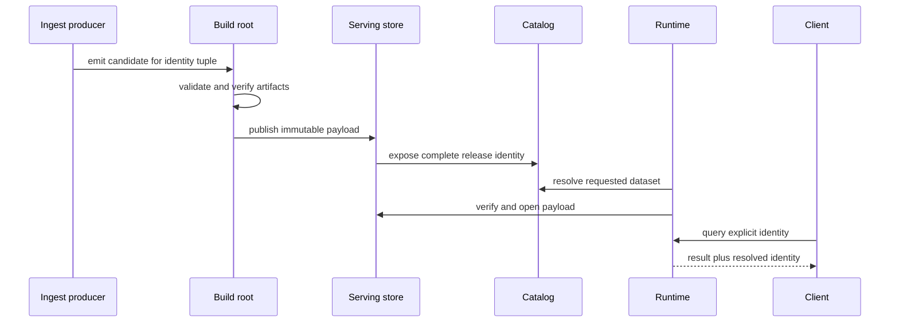

# Core Concepts

Atlas separates data identity, artifact custody, discovery, and execution.
Those boundaries let a consumer explain not only what was returned, but which
published bytes and which release identity authorized the result.

## The Concept Map

The most common mistake is to collapse these boundaries into one idea. Keep
them distinct:

- source inputs are not yet release state
- a build root is validated output, but not yet the serving store
- published artifacts and catalog state are the durable serving boundary

## Build Root

A build root is ingest output awaiting publication into a serving store. Atlas
can inspect and verify that state before the runtime depends on it.

Treat the build root as a staging boundary, not as the final public-serving shape.

## Dataset

A dataset is the logical unit of released data. Its identity combines release,
species, and assembly. Atlas validates, publishes, catalogs, and queries that
unit.

Treat `(release, species, assembly)` as one identity tuple. Changing any member
selects a different dataset. A directory name, process default, or cache entry
is not a substitute for the tuple.

## Release

A release is the versioned point in time for dataset content. Releases matter because:

- clients ask for them explicitly
- compatibility and diff workflows compare them
- publication and rollback are release-shaped operations

## Artifact

An artifact is the durable, immutable output of a validated build. It provides
a safe handoff between ingest and runtime serving.

This path explains why Atlas has more than one boundary after ingest. It leaves
room to verify and publish before the runtime depends on the data.

## Catalog

A catalog is the discoverable inventory of published datasets. It also records
their artifact locations or metadata. It answers two practical questions:

- what published dataset identities exist
- where the runtime should find their durable release state

## Store

The store persists immutable artifacts and related content. Atlas can expose
different implementations. Their role remains stable: hold durable artifact
state, not transient request state or raw ingest fixtures.

## Query

A query requests published dataset state. Its behavior is defined by:

- explicit parameters
- compatibility rules
- cost and limit enforcement
- deterministic structured responses

An Atlas query is more than running SQL or calling an endpoint. It is a
validated request against explicit published dataset state.

## Runtime Configuration

Runtime configuration controls server behavior. It does not change what the
released data means. That distinction matters:

- data artifacts define content state
- runtime config defines server behavior around that state

## Contract

A contract is a documented, test-backed promise about a stable surface. Atlas
uses contracts for:

- API schemas and endpoint behavior
- runtime configuration
- error codes and structured output
- operational expectations

## Authority by Question

| Question | Primary authority | Useful observation |
| --- | --- | --- |
| Which dataset is this? | explicit release, species, and assembly identity | response metadata or catalog lookup |
| Which bytes implement it? | artifact manifest and checksum lock | verified store read |
| May the runtime discover it? | published catalog entry | dataset-list response |
| How may it be queried? | query and interface contracts | CLI or HTTP result |
| How is the server behaving? | resolved runtime configuration and operational contracts | health, metrics, logs, and traces |
| May a candidate be promoted? | release policy plus candidate-bound evidence | readiness decision record |

An observation helps diagnose the system; it does not replace the authority.
For example, a cached query can show that retained bytes remain readable while
the catalog is unavailable, but it cannot authorize a newly published release.

## Follow One Dataset Through Atlas

At each handoff, preserve identity and reject ambiguity. A build root becomes
servable only after publication; a catalog entry becomes useful only when its
payload verifies; and a response becomes auditable only when its resolved
dataset is visible to the caller.

## Boundary Mistakes

Most Atlas confusion comes from mixing these layers:

- treating source inputs as if they were already release artifacts
- treating a build root as if it were already the serving store
- treating server memory or cache state as if it were durable product state
- treating internal helper code as if it were part of the public contract

When in doubt, ask three questions:

1. Is this source input, validated dataset state, or immutable artifact state?
2. Is this about runtime behavior or durable release content?
3. Is this a contract-owned surface or an implementation detail?

## Code And Config Authority

- dataset: `crates/bijux-atlas-model/src/dataset/` and
  `configs/sources/runtime/datasets/`
- query: `crates/bijux-atlas-query/src/`
- release and published artifact shape:
  `configs/schemas/contracts/release/` and
  `configs/schemas/contracts/datasets/`
- runtime-facing config and output:
  `crates/bijux-atlas-runtime/src/runtime/config/` and
  `configs/generated/runtime/`

When diagnosing a change or incident, name the boundary it touches: source,
build root, artifact, store, catalog, query, or runtime behavior. That boundary
identifies the relevant authority and prevents a downstream symptom from being
treated as upstream truth.
