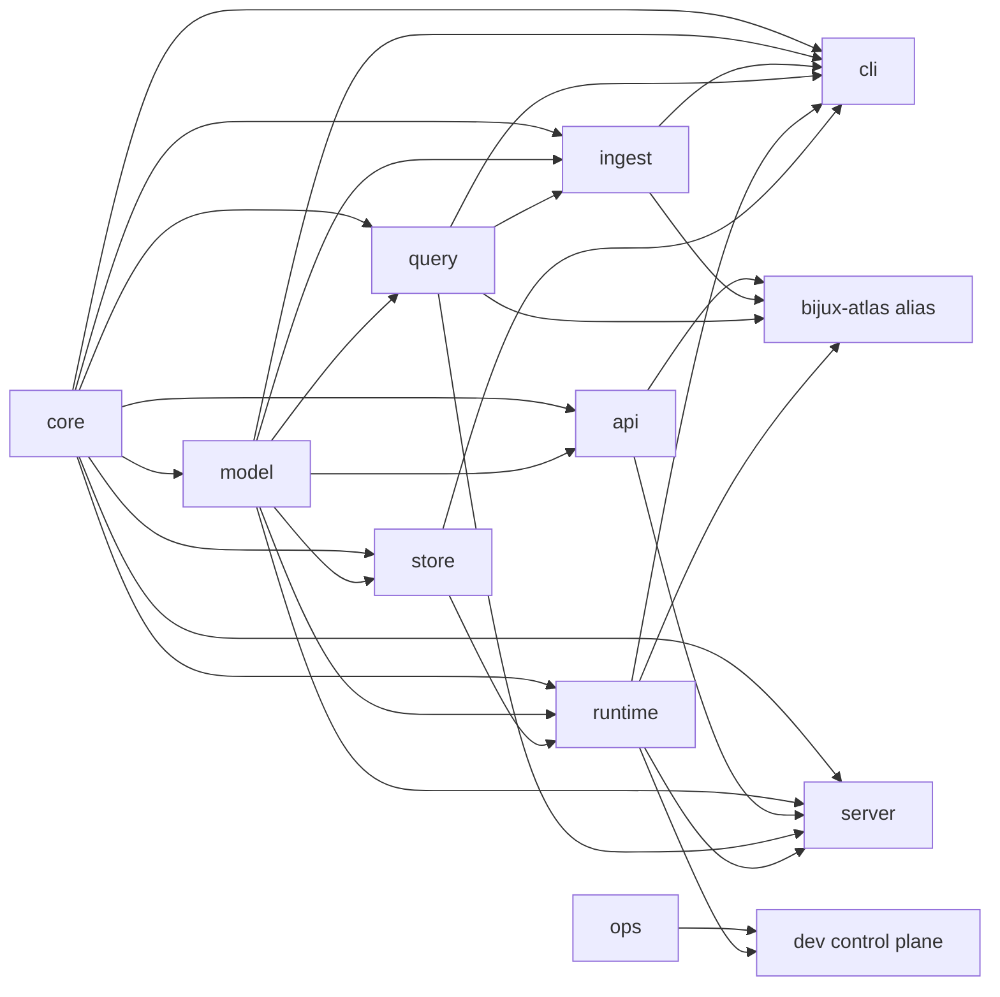

# Crate Boundary Contract

Atlas separates stable data and query semantics from product entrypoints,
runtime composition, operations policy, and repository automation. The Cargo
manifests are the executable dependency authority; this page explains the
ownership intent behind that graph.

## Crate Map

| Crate | Durable ownership |
| --- | --- |
| `bijux-atlas-core` | deterministic primitives, canonical serialization and hashing, and cross-domain invariants |
| `bijux-atlas-model` | persisted dataset identity, manifests, genes, diffs, sharding, and policy value types |
| `bijux-atlas-query` | query request model, classification, budgets, cursors, and SQLite query execution |
| `bijux-atlas-api` | HTTP parameter and wire contracts, errors, OpenAPI, and the Rust client |
| `bijux-atlas-store` | immutable publication layout, manifest locks, and local or remote store backends |
| `bijux-atlas-ingest` | normalization, validation, artifact construction, anomaly policy, and ingest evidence |
| `bijux-atlas-runtime` | reusable cache, store orchestration, configuration, domain policy, and runtime lifecycle support |
| `bijux-atlas-cli` | direct `bijux-atlas` command parsing, dispatch, output, completion, and plugin handshake |
| `bijux-atlas-server` | direct server entrypoint, HTTP hosting, middleware, target-bound state, and server integration |
| `bijux-atlas` | compatibility library that forwards historical paths to current owning crates |
| `bijux-atlas-ops` | operational registries, stack contracts, and repository-owned ops path models |
| `bijux-atlas-dev` | repository checks, suites, governance, evidence, and maintainer automation |

## Dependency Direction

The normal workspace dependencies form this graph:

Arrows point from dependency to consumer. Transitive edges are omitted. The CLI
and server depend directly on the domain-specific crates they expose; runtime
does not absorb API, query, or ingest ownership. The operations crate has no
normal dependency on another Atlas crate, while the development control plane
consumes both operations contracts and runtime surfaces.

## Ownership Rules

- Core and model stay free of runtime, transport, storage implementation, and
  maintainer dependencies.
- Query owns query semantics; API owns HTTP parsing and wire shape; a server
  handler connects them without redefining either.
- Store owns publication and backend behavior. Runtime coordinates stores but
  does not duplicate immutable layout rules.
- Ingest owns source normalization and artifact construction. Runtime and dev
  automation must not implement ingest semantics.
- CLI and server own their binaries and adapter trees. Binary wrappers remain
  thin; behavior belongs in their owned modules and reusable crates.
- Runtime owns reusable composition and lifecycle support. It is not a fixture
  warehouse or a compatibility catch-all.
- The compatibility crate forwards API, query, ingest, and runtime paths. New
  implementation does not belong there.
- Operations defines durable ops models. Development automation consumes those
  models and owns repository execution, not product behavior.
- Benchmarks and fixtures live with the crate whose behavior they measure.

Within runtime and server crates, `domain` contains transport-independent
policy, `app` coordinates use cases and ports, adapters connect external
effects, and runtime or server composition wires the process. HTTP handlers
must call application/query boundaries instead of reaching into storage or
filesystem internals.

## Change Test

Before moving or adding behavior, answer:

1. Which crate owns the semantic decision?
2. Is the new dependency directed toward a lower-level owner or back toward an
   entrypoint?
3. Does the move change a public Rust path, binary, HTTP shape, artifact, or
   generated contract?
4. Which compatibility facade, test, benchmark, fixture, and documentation must
   move with it?

A cycle-breaking convenience re-export is not a durable owner. Prefer a direct
dependency on the semantic owner and keep compatibility forwarding isolated in
`bijux-atlas`.

## Enforcement

Cargo compilation enforces declared dependency direction. Focused architecture
tests additionally check selected boundaries:

- runtime tests keep compatibility forwarders out of runtime, verify alias
  forwarders, and keep benchmark harnesses under `benches/`;
- ingest tests keep ingest benchmarks in the ingest crate;
- API guardrails reject runtime/server dependencies and selected transport or
  storage tokens;
- server guardrails keep runtime application code free of HTTP framework
  imports and route gene queries through the application-query boundary; and
- dev guardrails reject selected ingest, query, and server implementation
  tokens in the control plane.

The crate-boundary document test verifies that this page and its required crate
markers exist. It does not prove every statement in the page. Several source
guardrails are token- or path-based rather than a complete Rust dependency
analyzer. Review the Cargo manifest diff and affected public surfaces even when
those tests pass.

Boundary drift is a product defect when it obscures ownership, introduces a
forbidden dependency, or moves consumer behavior without a compatibility
decision.
