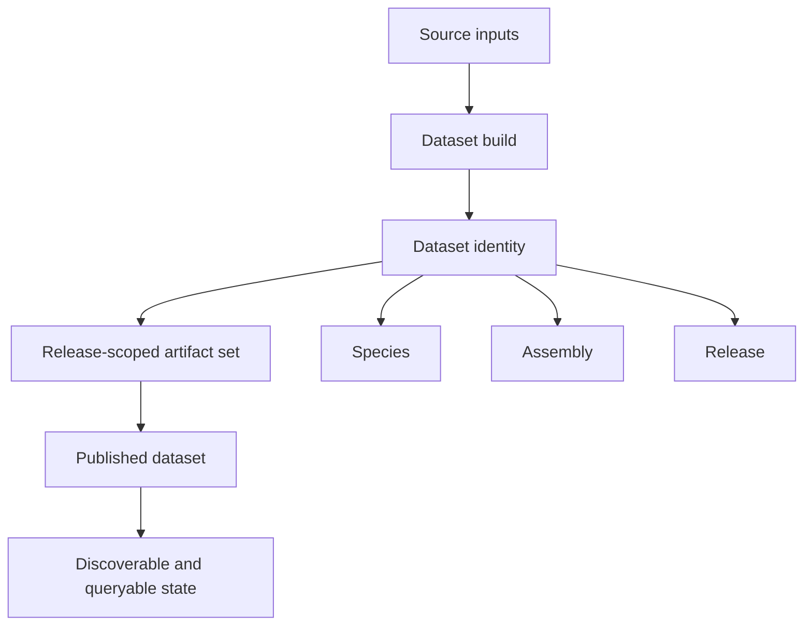

# Dataset Model

Atlas treats a dataset as a release-shaped serving unit, not as a loose bundle
of files.

The dataset is the unit that ties together ingest, publication, catalog
visibility, query routing, and rollback reasoning. This page matters because if
the dataset boundary is fuzzy, readers start confusing source input, build
output, published release state, and runtime-serving state.

The stable identity usually combines release, species, and assembly. That
identity is the anchor for ingest, publication, catalog lookup, query routing,
diff workflows, and rollback reasoning.

## What A Dataset Owns

- source-derived validated content
- immutable release artifacts
- catalog-visible identity
- queryable runtime state after publication

## Why It Matters

If the dataset boundary stays clear, Atlas can keep ingest, serving, and
operations honest about what is actually being changed.

## Repository Authorities

- dataset domain logic: `crates/bijux-atlas/src/domain/dataset/`
- ingest-time dataset construction:
  `crates/bijux-atlas/src/domain/ingest/engine/`
- manifest and serving-shape contracts:
  `configs/schemas/contracts/datasets/manifest.schema.json` and
  `configs/sources/runtime/datasets/manifest.yaml`

## Main Takeaway

A dataset is not just “some data Atlas can read.” It is the release-shaped unit
Atlas knows how to validate, publish, catalog, and serve. Treating it that way
keeps the product model coherent across workflows, runtime behavior, and
contracts.
