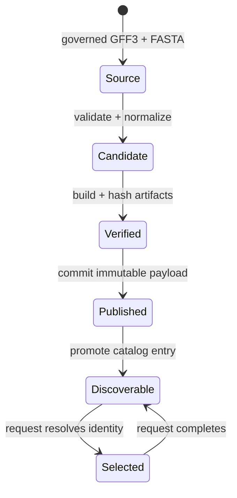
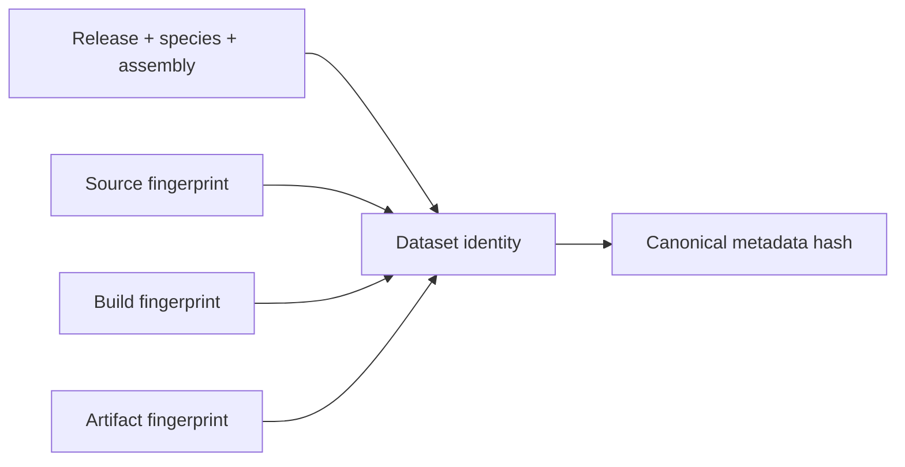

# Dataset model

An Atlas dataset is one immutable, queryable release of biological data. It is
identified by three values—release, species, and assembly—and carries that
identity from source admission to every query response.

For example, `110/homo_sapiens/GRCh38` means Ensembl release `110`, human, and
the GRCh38 assembly. It is not interchangeable with another assembly, another
release, or different source bytes published under a similar directory name.

## Lifecycle

```mermaid
stateDiagram-v2
    [*] --> Source: governed GFF3 + FASTA
    Source --> Candidate: validate + normalize
    Candidate --> Verified: build + hash artifacts
    Verified --> Published: commit immutable payload
    Published --> Discoverable: promote catalog entry
    Discoverable --> Selected: request resolves identity
    Selected --> Discoverable: request completes
```

| State | What is true | What is not yet true |
| --- | --- | --- |
| source | Provenance and admission inputs are known | Normalized content and serving artifacts exist |
| candidate | Normalized records and build inputs share one identity | Required artifacts and hashes have passed verification |
| verified | Manifest, files, statistics, and hashes agree | A serving store contains the payload |
| published | Immutable payload exists under the store contract | A catalog advertises it |
| discoverable | A catalog maps the identity to published bytes | Every runtime instance has observed it |
| selected | One request resolved and opened that exact identity | Other requests or instances are healthy or current |

These boundaries prevent two unsafe shortcuts: serving an ingest directory as
though it were published, and discovering a catalog entry before its payload
is complete.

## Identity forms

| Representation | Example | Used for |
| --- | --- | --- |
| canonical release ID | `110/homo_sapiens/GRCh38` | Manifests, logs, fingerprints, and internal joins |
| dataset key | `release=110&species=homo_sapiens&assembly=GRCh38` | Explicit selectors and public interfaces |

Release values are numeric strings. Persisted species names use lowercase
snake case. Assembly names preserve meaningful case and accept letters,
digits, dots, and underscores. Admission may normalize `Homo-sapiens` to
`homo_sapiens`; published identities remain strict after that boundary.

## Names are not enough

```mermaid
flowchart LR
    Name[Release + species + assembly] --> Identity[Dataset identity]
    Source[Source fingerprint] --> Identity
    Build[Build fingerprint] --> Identity
    Artifacts[Artifact fingerprint] --> Identity
    Identity --> Hash[Canonical metadata hash]
```

`DatasetIdentity` joins the three-part name with SHA-256 fingerprints for the
source, build inputs, and artifact inventory. Reusing the name with different
source or artifact bytes is an identity violation, not another copy of the
same release.

Within one identity:

- manifest, catalog, and response identities agree;
- required hashes resolve to the published bytes;
- publication never replaces readable content with different bytes;
- rollback selects an earlier published identity instead of mutating one;
- caches accelerate access without becoming dataset authority.

## Where the contract lives

- identity and catalog models:
  [`crates/bijux-atlas-model/src/dataset/`](../../../crates/bijux-atlas-model/src/dataset/)
- ingest construction:
  [`crates/bijux-atlas-ingest/src/engine/`](../../../crates/bijux-atlas-ingest/src/engine/)
- manifest schema and serving source:
  [`manifest.schema.json`](../../../configs/schemas/contracts/datasets/manifest.schema.json)
  and [`manifest.yaml`](../../../configs/sources/runtime/datasets/manifest.yaml)

Continue with the [Serving Store Model](../runtime/serving-store-model.md) for
publication and read semantics, and [Artifact and Store Contracts](../contracts/artifact-and-store-contracts.md)
for the durable interface.
