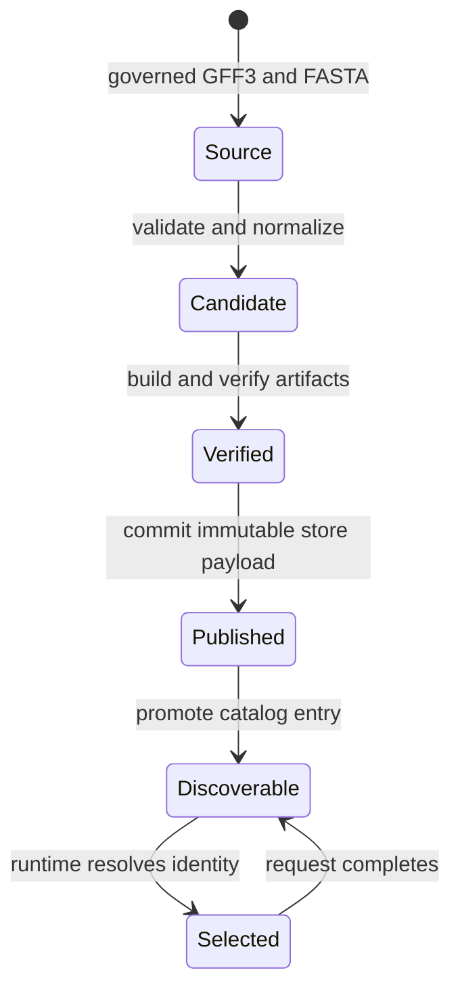
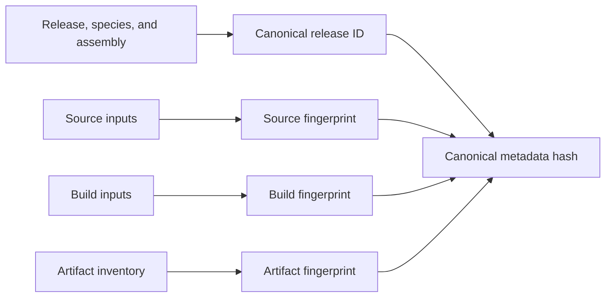

# Dataset Model

Atlas treats a dataset as a release-shaped serving unit, not as a loose bundle
of files.

Its identity combines release, species, and assembly. The same identity follows
the dataset through admission, artifact creation, store publication, catalog
promotion, query resolution, comparison, and rollback. A path on disk or a
server's in-memory selection is not a substitute for that identity.

```mermaid
stateDiagram-v2
    [*] --> Source: governed GFF3 and FASTA
    Source --> Candidate: validate and normalize
    Candidate --> Verified: build and verify artifacts
    Verified --> Published: commit immutable store payload
    Published --> Discoverable: promote catalog entry
    Discoverable --> Selected: runtime resolves identity
    Selected --> Discoverable: request completes
```

Each transition adds a distinct fact. Verification establishes that a
candidate is internally coherent. Publication establishes that immutable bytes
exist under the store contract. Promotion establishes discoverability. Runtime
selection establishes which published dataset answered one request.

## Dataset States

| State | Durable facts | What is still unproven |
| --- | --- | --- |
| source | input identity, provenance, and admission policy | normalized content or usable artifacts |
| candidate | normalized records and build inputs under one dataset identity | artifact integrity and publication |
| verified | required files, hashes, statistics, and manifest agree | store presence and catalog visibility |
| published | immutable payload is committed to the selected store | discoverability through the catalog |
| discoverable | catalog maps the identity to the published payload | observation by every running instance |
| selected | one request resolved the catalog and opened the payload | health or freshness of other instances |

State may advance only when the evidence for the next boundary exists. A
completed ingest directory cannot be served as though it were published, and a
published store prefix cannot be queried by discovery until catalog promotion
has succeeded.

## Identity and Immutability

Within one release identity:

- manifest identity and catalog identity must agree;
- required artifact hashes must resolve to the published bytes;
- publication must not replace an existing payload with different content;
- responses must expose the identity actually resolved by the runtime;
- rollback selects an earlier published identity rather than mutating the
  current release in place.

Mutable caches and process-local handles may accelerate access, but they do not
own dataset truth. Losing them may affect latency or availability; it must not
change the meaning of the published dataset.

## Canonical Identity and Fingerprints

The model has two text representations for the same three-part identity:

| Representation | Form | Use |
| --- | --- | --- |
| canonical release ID | `110/homo_sapiens/GRCh38` | manifests, fingerprints, logs, and internal joins |
| dataset key | `release=110&species=homo_sapiens&assembly=GRCh38` | explicit selectors and interfaces |

Release values are numeric strings. Persisted species values use lowercase
snake case, while assembly values preserve meaningful case and accept letters,
digits, dots, and underscores. Input normalization may turn a value such as
`Homo-sapiens` into `homo_sapiens`, but stored identities and dataset keys are
strict. Normalization belongs at a declared admission boundary; it must not
make two published identities appear interchangeable after publication.

```mermaid
flowchart LR
    Tuple[Release, species, and assembly] --> Canonical[Canonical release ID]
    Source[Source inputs] --> SourceHash[Source fingerprint]
    Build[Build inputs] --> BuildHash[Build fingerprint]
    Artifacts[Artifact inventory] --> ArtifactHash[Artifact fingerprint]
    Canonical --> Identity[Canonical metadata hash]
    SourceHash --> Identity
    BuildHash --> Identity
    ArtifactHash --> Identity
```

`DatasetIdentity` joins the canonical release ID with separate source, build,
and artifact SHA-256 fingerprints, then hashes their canonical serialization.
Matching the three-part name is therefore necessary but insufficient: a
different source, build contract, or artifact set under the same name is an
identity violation, not another valid copy of the release.

## Repository Authorities

- dataset identities and catalog values:
  [`crates/bijux-atlas-model/src/dataset/`](../../../crates/bijux-atlas-model/src/dataset/)
- ingest-time dataset construction:
  [`crates/bijux-atlas-ingest/src/engine/`](../../../crates/bijux-atlas-ingest/src/engine/)
- manifest and serving-shape contracts:
  [`manifest.schema.json`](../../../configs/schemas/contracts/datasets/manifest.schema.json)
  and [`manifest.yaml`](../../../configs/sources/runtime/datasets/manifest.yaml)

The [release model](release-model.md) defines the wider software and dataset
release boundary. [Artifact and store contracts](../contracts/artifact-and-store-contracts.md)
define the publication rules in detail.
