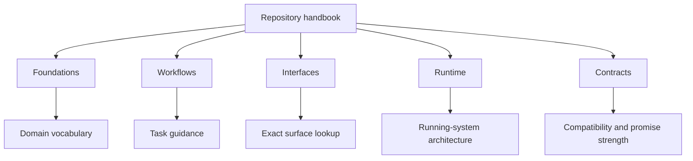

# Documentation Map

The Atlas repository handbook is organized around five durable slices:

- `foundations` for product identity and core concepts
- `workflows` for ingest, dataset, and query usage
- `interfaces` for CLI, API, config, and exact lookups
- `runtime` for architecture and serving behavior
- `contracts` for published promises and compatibility rules

## Handbook Map

This diagram is here to make the docs tree feel intentional rather than
incidental. Each slice is supposed to answer a different class of question.

## How To Use It

Start in `foundations` when you need the mental model. Move to `workflows`
when you are doing product work. Move to `interfaces`, `runtime`, or
`contracts` when the question becomes exact.

## Reader Map

Use this table when you are unsure where a question belongs:

| If the question sounds like... | Start here |
| --- | --- |
| What is Atlas for? | [What Atlas Is](what-atlas-is.md) |
| Which concepts matter before I run anything? | [Core Concepts](core-concepts.md) |
| How do I install, ingest, start, or query? | [Workflows](../workflows/index.md) |
| Which flag, endpoint, env var, or output is public? | [Interfaces](../interfaces/index.md) |
| How does the runtime actually work? | [Runtime](../runtime/index.md) |
| Is this a compatibility promise? | [Contracts](../contracts/index.md) |

## Repository Map

Use this table when you want to jump from the docs slice to the real source of
truth in the repo:

| Docs slice | Main repository anchors |
| --- | --- |
| foundations | `crates/bijux-atlas/src/domain/` |
| workflows | `configs/examples/` plus runnable product entrypoints |
| interfaces | `crates/bijux-atlas/src/adapters/inbound/` and `src/bin/` |
| runtime | `crates/bijux-atlas/src/runtime/`, `src/app/`, and `src/adapters/` |
| contracts | `crates/bijux-atlas/src/contracts/` and `configs/schemas/contracts/` |

## Ownership Boundary

This repository handbook is only one of the Atlas documentation domains:

- `bijux-atlas` is the product runtime handbook
- `bijux-atlas-ops` is the operational handbook
- `bijux-atlas-dev` is the maintainer control-plane handbook

If a page starts drifting into Helm values, incident response, CI lanes, or
GitHub workflow ownership, it probably belongs outside the repository handbook.

## Navigation Rule

The cleanest reading pattern is:

1. choose the top navigation domain first
2. choose the section home inside that domain
3. move to exact reference or contract pages only after the model is clear

## Main Takeaway

The documentation map should help readers move from idea to code without losing
their footing. The handbook slices are durable because they separate mental
model, task flow, exact surface lookup, runtime architecture, and explicit
promise strength instead of blending them together.
