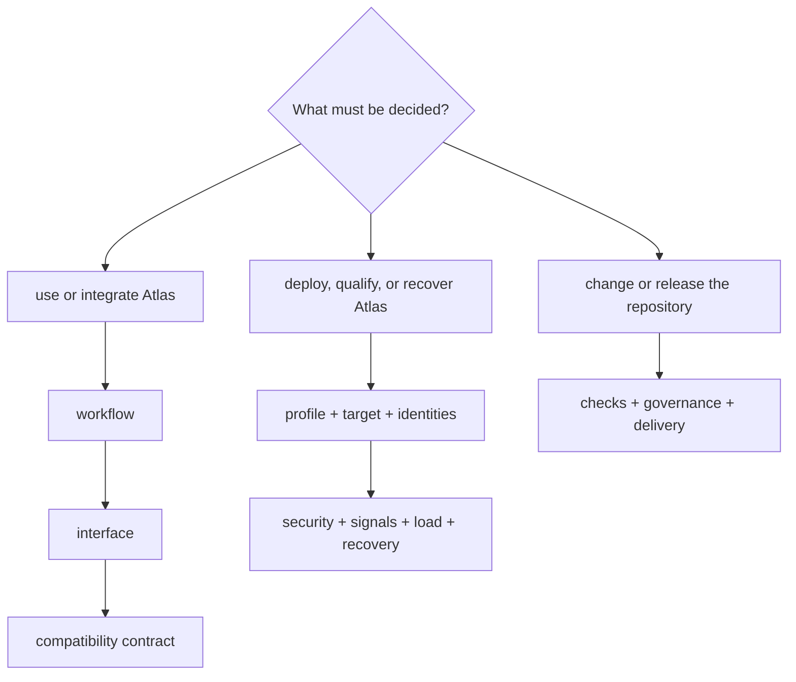

# Atlas Decision Map

Start with the owner of the decision: product use, deployment operation, or
repository maintenance. Cross into another handbook only when the decision
crosses that authority boundary.

```mermaid
flowchart TD
    Question{"What must be decided?"}
    Question --> Product["use or integrate Atlas"]
    Question --> Ops["deploy, qualify, or recover Atlas"]
    Question --> Dev["change or release the repository"]
    Product --> Workflow["workflow"]
    Workflow --> Interface["interface"]
    Interface --> Contract["compatibility contract"]
    Ops --> Target["profile + target + identities"]
    Target --> Evidence["security + signals + load + recovery"]
    Dev --> Control["checks + governance + delivery"]
```

## Product Questions

| Need | Start here |
| --- | --- |
| understand product identity and limits | [Foundations](index.md) |
| install, ingest, publish, start, or query | [Workflows](../workflows/index.md) |
| find a command, endpoint, setting, or output | [Interfaces](../interfaces/index.md) |
| understand processes, storage, caching, or request flow | [Runtime](../runtime/index.md) |
| assess compatibility or ownership | [Contracts](../contracts/index.md) |

Product contracts define behavior. They do not prove a particular cluster
enforced policy or sustained load.

## Operations Questions

| Need | Start here |
| --- | --- |
| resolve a deployment topology | [Stack](../../bijux-atlas-ops/stack/index.md) |
| render, admit, roll out, or drain workloads | [Kubernetes](../../bijux-atlas-ops/kubernetes/index.md) |
| assess identity, exposure, or artifact trust | [Security](../../bijux-atlas-ops/security/index.md) |
| trace health, metrics, logs, or spans | [Observability](../../bijux-atlas-ops/observability/index.md) |
| establish capacity or resilience | [Load](../../bijux-atlas-ops/load/index.md) |
| promote, distribute, roll back, or recover | [Release](../../bijux-atlas-ops/release/index.md) |

Operations evidence is target-bound. It cannot redefine dataset semantics,
public interfaces, or artifact contracts.

## Maintainer Questions

| Need | Start here |
| --- | --- |
| understand repository layout and ownership | [Workspace](../../bijux-atlas-dev/workspace/index.md) |
| run typed checks or interpret reports | [Automation](../../bijux-atlas-dev/automation/index.md) |
| assess policy or compatibility governance | [Governance](../../bijux-atlas-dev/governance/index.md) |
| prepare CI, packages, documentation, or releases | [Delivery](../../bijux-atlas-dev/delivery/index.md) |
| find review and workflow ownership | [Workflow Ownership](../../bijux-atlas-dev/workflow-ownership/index.md) |

Maintainer validation establishes repository conformance for its declared
inputs. It is not a user-facing runtime interface or target qualification.

## Evidence Strength

Move from meaning to observation without skipping a boundary:

1. concepts define the vocabulary;
2. interfaces enumerate consumer-visible surfaces;
3. contracts define stability and compatibility;
4. workflows connect supported operations;
5. execution reports record observed behavior; and
6. release or deployment receipts bind that behavior to exact identities.

Examples and generated references are useful before execution. Neither is a
substitute for candidate-bound evidence when the decision concerns a release,
deployment, incident, or recovery.
