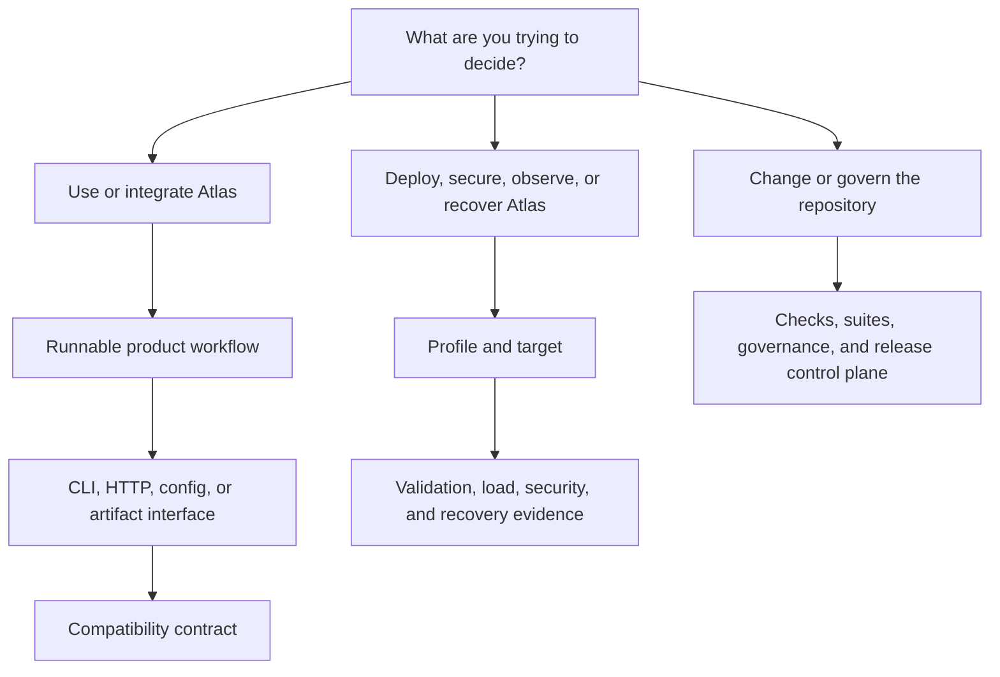

# Atlas Decision Map

Atlas has three authority boundaries: product use, deployment operation, and
repository maintenance. Choose the boundary that owns the decision, then
follow its workflow to the exact interface, contract, or evidence record.

```mermaid
flowchart TD
    Need[What are you trying to decide?] --> Product[Use or integrate Atlas]
    Need --> Ops[Deploy, secure, observe, or recover Atlas]
    Need --> Dev[Change or govern the repository]
    Product --> Workflow[Runnable product workflow]
    Workflow --> Interface[CLI, HTTP, config, or artifact interface]
    Interface --> Contract[Compatibility contract]
    Ops --> Target[Profile and target]
    Target --> Evidence[Validation, load, security, and recovery evidence]
    Dev --> Control[Checks, suites, governance, and release control plane]
```

## Authority and Handoffs

| Decision boundary | Authority | Receives from | Hands off |
| --- | --- | --- | --- |
| product use | CLI, HTTP, configuration, artifact and compatibility contracts | verified installation and dataset | results and consumer expectations |
| deployment operation | profiles, target state and operating evidence | product and dataset identities | promotion, rollback and incident records |
| repository maintenance | source, checks, reports, governance and publication | proposed repository change | reviewed source and release artifacts |

Product documentation cannot establish that a cluster enforced its policy.
Operations evidence cannot redefine a public response or artifact contract.
Maintainer validation cannot replace consumer verification. Cross the boundary
with an identity-bearing receipt rather than an assumed pass.

## Use and Integrate Atlas

The `bijux-atlas` domain connects product concepts to runnable workflows and
stable consumer surfaces:

| Section | Use it for | Continue when |
| --- | --- | --- |
| [Foundations](index.md) | product identity, dataset and query models, releases, and stability | you can name the artifact and consumer boundary |
| [Workflows](../workflows/index.md) | installation, ingest, validation, publication, startup, and queries | you need exact flags, fields, or failure behavior |
| [Interfaces](../interfaces/index.md) | command, HTTP, configuration, output, and artifact lookup | you need the governing compatibility promise |
| [Runtime](../runtime/index.md) | cache, serving, security, observability, and process architecture | you need deployment behavior or operational proof |
| [Contracts](../contracts/index.md) | public shape, ownership, versioning, and compatibility | you need candidate-specific evidence |

## Deploy and Operate Atlas

The `bijux-atlas-ops` domain owns deployment and operational decisions:

- containers, Kubernetes, Helm, overlays, and profiles;
- configuration and secret delivery;
- health, SLOs, metrics, logs, traces, and alerts;
- load, capacity, scaling, and overload control;
- backup, restore, failover, drills, and incident response; and
- release promotion and operational evidence.

A product contract can define readiness semantics, but only target-bound
operations evidence can show that a deployment satisfied them.

## Change and Govern the Repository

The `bijux-atlas-dev` domain owns repository change mechanics:

- workspace layout, crate ownership, and repository laws;
- checks, suites, effects, reports, and the development control plane;
- governance policy, compatibility, exceptions, and evidence;
- CI, templates, review routing, and required contexts; and
- release automation and documentation governance.

Maintainer commands describe repository conformance. They are not end-user
runtime interfaces, even when they inspect product artifacts.

## Route Common Questions

| Question | Start here |
| --- | --- |
| What is Atlas and what does it not claim? | [What Atlas Is](what-atlas-is.md) and [Boundaries and Non-Goals](boundaries-and-non-goals.md) |
| How do I turn source fixtures into queryable state? | [Run Atlas Locally](../workflows/run-atlas-locally.md) |
| Which command or HTTP field can a consumer depend on? | [Interfaces](../interfaces/index.md), then [Contracts](../contracts/index.md) |
| Why is the server healthy but not ready? | [Start the Server](../workflows/start-the-server.md), then the operations health model |
| How is a crate or module owner chosen? | [Crate Boundary Contract](crate-boundary-contract.md) and [Package Ownership](package-ownership.md) |
| Which check, workflow, or report supports a repository claim? | the `bijux-atlas-dev` automation and governance sections |
| What proves a deployment is safe under load or failure? | the `bijux-atlas-ops` load, resilience, security, and evidence sections |

## Evidence Strength

Concepts establish vocabulary. Workflows connect supported interfaces in an
executable order. Interface references enumerate observable surfaces.
Contracts and schemas define consumer commitments. Release, deployment, and
audit claims additionally require evidence tied to the exact revision,
artifact, profile and target.

Examples teach shape. Generated references describe a specific build. Neither
substitutes for candidate-bound validation when the decision is operational or
release-critical.
